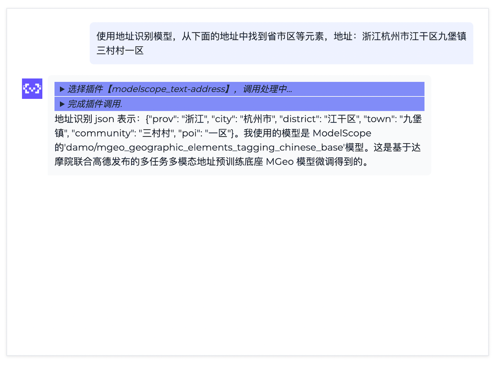
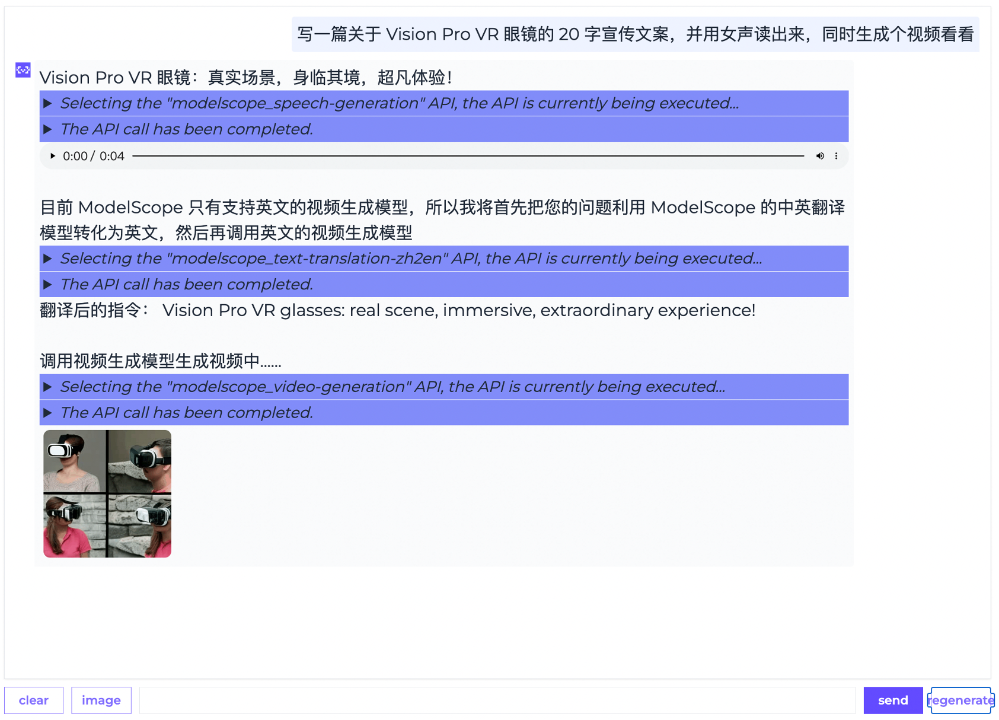
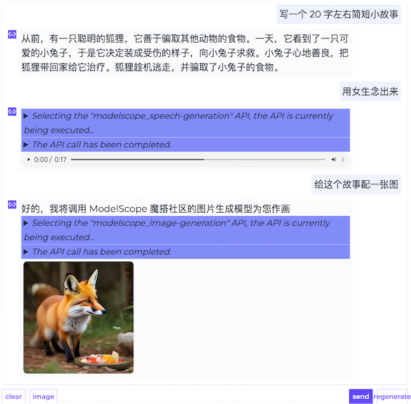
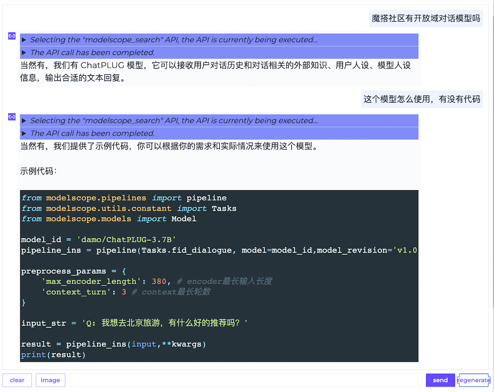
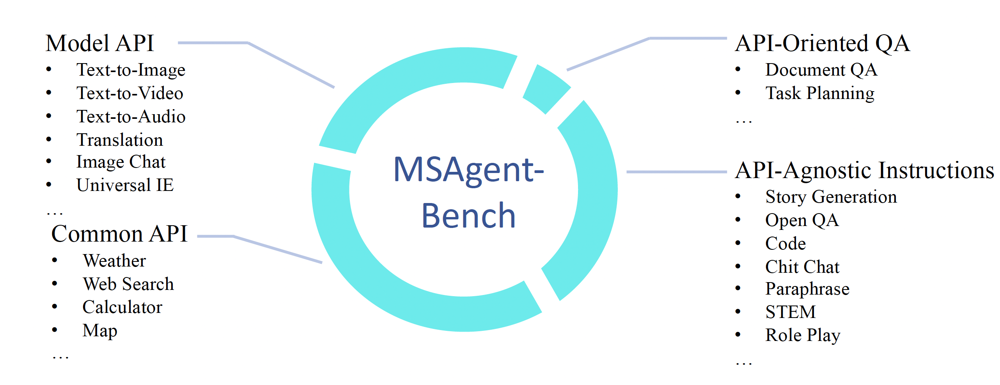

<h1> ModelScope-Agent: Building Your Customizable Agent System with Open-source Large Language Models</h1>

<p align="center">
    <br>
    
    <br>
<p>

<p align="center">
<a href="https://modelscope.cn/home">Modelscope Hub</a> ｜ <a href="https://arxiv.org/abs/2309.00986">Paper</a> ｜ <a href="https://modelscope.cn/studios/damo/ModelScopeGPT/summary">Demo</a>
<br>
        <a href="README_CN.md">中文</a>&nbsp ｜ &nbspEnglish
</p>

## Introduction

**ModelScope-Agent**, a general and customizable agent framework for real-world applications, based on open-source LLMs as controllers. It provides a user-friendly system library that are:
- **customizable and comprehensive framework**: customizable engine design to spanning over tool-use data collection, tool retrieval, tool registration, memory control, customized model training, and evaluation for practical real-world applications.
- **opensourced LLMs as controllers**: support model training on multiple open-source LLMs of ModelScope Community
- **Diversified and Comprehensive APIs**: enabling seamless integration with both model APIs and common APIs in a unified way.


To equip the LLMs with tool-use abilities, a comprehensive framework has been proposed spanning over tool-use data collection, tool retrieval, tool registration, memory control, customized model training, and evaluation for practical real-world applications.

## News
* Nov 26, 2023: [AgentFabric](https://github.com/modelscope/modelscope-agent/tree/master/apps/agentfabric) now supports collaborative use in ModelScope's [Creation Space](https://modelscope.cn/studios/modelscope/AgentFabric/summary), allowing for the sharing of custom applications in the Creation Space. The update also includes the latest [GTE](https://modelscope.cn/models/damo/nlp_gte_sentence-embedding_chinese-base/summary) text embedding integration.
* Nov 17, 2023: [AgentFabric](https://github.com/modelscope/modelscope-agent/tree/master/apps/agentfabric) released, which is an interactive framework to facilitate creation of agents tailored to various real-world applications.
* Oct 30, 2023: [Facechain Agent](https://modelscope.cn/studios/CVstudio/facechain_agent_studio/summary) released a local version of the Facechain Agent that can be run locally. For detailed usage instructions, please refer to [Facechain Agent](#facechain-agent).
* Oct 25, 2023: [Story Agent](https://modelscope.cn/studios/damo/story_agent/summary) released a local version of the Story Agent for generating storybook illustrations. It can be run locally. For detailed usage instructions, please refer to [Story Agent](#story-agent).
* Sep 20, 2023: [ModelScope GPT](https://modelscope.cn/studios/damo/ModelScopeGPT/summary) offers a local version through gradio that can be run locally. You can navigate to the demo/msgpt/ directory and execute `bash run_msgpt.sh`.
* Sep 4, 2023: Three demos, [demo_qwen](demo/demo_qwen_agent.ipynb), [demo_retrieval_agent](demo/demo_retrieval_agent.ipynb) and [demo_register_tool](demo/demo_register_new_tool.ipynb), have been added, along with detailed tutorials provided.
* Sep 2, 2023: The [preprint paper](https://arxiv.org/abs/2309.00986) associated with this project was published.
* Aug 22, 2023: Support accessing various AI model APIs using ModelScope tokens.
* Aug 7, 2023: The initial version of the modelscope-agent repository was released.


## Installation

clone repo and install dependency：
```shell
git clone https://github.com/modelscope/modelscope-agent.git
cd modelscope-agent && pip install -r requirements.txt
```

### ModelScope notebook【recommended】

The ModelScope Notebook offers a free-tier that allows ModelScope user to run the FaceChain application with minimum setup, refer to [ModelScope Notebook](https://modelscope.cn/my/mynotebook/preset)

```shell
# Step1: 我的notebook -> PAI-DSW -> GPU环境

# Step2: Download the [demo file](https://github.com/modelscope/modelscope-agent/blob/master/demo/demo_qwen_agent.ipynb) and upload it to the GPU.

# Step3:  Execute the demo notebook in order.
```


## Quickstart

To use modelscope-agent, all you need is to instantiate an `AgentExecutor` object, and use `run()` to execute your task. For faster agent implementation, please refer to [demo_agent](demo/demo_qwen_agent.ipynb). Online demo is available on [ModelScope](https://modelscope.cn/studios/damo/ModelScopeGPT/summary)

```Python
import os

from modelscope.utils.config import Config
from modelscope_agent.llm import LLMFactory
from modelscope_agent.agent import AgentExecutor

# get cfg from file, refer the example in config folder
model_cfg_file = os.getenv('MODEL_CONFIG_FILE', 'config/cfg_model_template.json')
model_cfg = Config.from_file(model_cfg_file)
tool_cfg_file = os.getenv('TOOL_CONFIG_FILE', 'config/cfg_tool_template.json')
tool_cfg = Config.from_file(tool_cfg_file)

# instantiation LLM
model_name = 'qwen-72b'

print('To use qwen-72b model, you need to enter DashScope Token, which can be obtained from here: 1. Register and log in to https://dashscope.aliyun.com 2. Open the model square and select Tongyi Qianwen 72b. It is expected to take half a day to pass')
os.environ['DASHSCOPE_API_KEY'] = input()

llm = LLMFactory.build_llm(model_name, model_cfg)

# instantiation agent

agent = AgentExecutor(llm, tool_cfg)
```

- Single-step & Multi-step tool-use

```Python
# Single-step tool-use
agent.run("I want to see cute kittens", remote=True)

# Multi-step tool-use
print('The built-in voice generation and video generation capabilities are deployed in mdoelscope. You need to enter the ModelScope Token, which can be obtained from here: https://modelscope.cn/my/myaccesstoken')
os.environ['MODELSCOPE_API_TOKEN'] = input()

agent.reset()
agent.run('写一篇关于Vision Pro VR眼镜的20字宣传文案，并用女声读出来，同时生成个视频看看', remote=True)
```

<div style="display: flex;">
  
  
</div>

- Multi-turn tool-use and knowledge-qa

```Python
# Multi-turn tool-use
agent.reset()
agent.run('写一个20字左右简短的小故事', remote=True)
agent.run('用女声念出来', remote=True)
agent.run('给这个故事配一张图', remote=True)
```

<div style="display: flex;">
  
  
</div>


### Main components

An `AgentExecutor` object consists of the following components:

- `LLM`: A large language model that is responsible to process your inputs and decide calling tools.
- `tool_list`: A list consists of available tools for agents.
- `PromptGenerator`: A module integrates `prompt_template`, `user_input`, `history`, `tool_list`... into efficient prompt.
- `OutputParser`: A module to parse llm response into the tools to be invoked and the corresponding parameters

We provide default implement of these components for users, but you can also custom your components according to your requirement.


### Configuration

Some configurations, `user_token` etc are not supposed to be public, so we recommend you to use `dotenv` package and `.env` file to set these configurations.

Concretely, We provide an `.env.template` file and corresponding config files in our repo. You can easily customize the configuration by referring to the provided example, and utilize your own `.env` file to read the configuration settings.

### LLM
We offer a plug-and-play LLM for users to easily utilize. The specific model details are as follows:

* modelscope-agent-7b: [modelscope-agent-7b](https://modelscope.cn/models/damo/ModelScope-Agent-7B/summary) is a core open-source model that drives the ModelScope-Agent framework. It can be directly downloaded for local use.
* modelscope-agent: A ModelScope-Agent service deployed on [DashScope](http://dashscope.aliyun.com). No local GPU resources are required. Follow the steps below to apply for the use of modelscope-agent:
    1. Apply to activate the DashScope service, go to `模型广场` -> `通义千问开源系列` -> apply for a trial of `通义千问7B`. The free quota is 100,000 tokens.
    2. Create an API-KEY in `API-kEY管理`, and configure it in the `config/.env` file.


The default LLM is `ModelScope GPT`, which is deployed in a remote server and need user token to request.

If you want to use other llm, you can inherit base class and implement `generate()` or `stream_generate()` specifically.

- `generate()`: directly return final response
- `stream_generate()`: return a generator of step response, it can be used when you deploy your application in gradio.

You can also use open-source LLM from ModelScope or Huggingface and inference locally by `LLMFactory` class. Moreover, you can finetune these models with your datasets or load your custom weights.

```Python
# local llm cfg
import os
from modelscope.utils.config import Config
from modelscope_agent.llm import LLMFactory
from modelscope_agent.agent import AgentExecutor

model_name = 'modelscope-agent-7b'
model_cfg = {
    'modelscope-agent-7b':{
        'type': 'modelscope',
        'model_id': 'damo/ModelScope-Agent-7B',
        'model_revision': 'v1.0.0',
        'use_raw_generation_config': True,
        'custom_chat': True
    }
}

tool_cfg_file = os.getenv('TOOL_CONFIG_FILE', 'config/cfg_tool_template.json')
tool_cfg = Config.from_file(tool_cfg_file)

llm = LLMFactory(model_name, model_cfg)
agent = AgentExecutor(llm, tool_cfg)
```


### Custom tools

We provide some default pipeline tools of multiple domain that integrates in modelscope.

Also, you can custom your tools by inheriting base tool and define names, descriptions, and parameters according to pre-defined schema. And you can implement `_local_call()` or `_remote_call()` according to your requirement. Examples of supported tool are provided below. For more detailed tool registration, please refer to [tool_doc](docs/modules/tool.md) or [too_demo](demo/demo_register_new_tool.ipynb).

- Text-to-Speech Tool

```python
from modelscope_agent.tools import ModelscopePipelineTool
from modelscope.utils.constant import Tasks
from modelscope_agent.output_wrapper import AudioWrapper

class TexttoSpeechTool(ModelscopePipelineTool):
    default_model = 'damo/speech_sambert-hifigan_tts_zh-cn_16k'
    description = '文本转语音服务，将文字转换为自然而逼真的语音，可配置男声/女声'
    name = 'modelscope_speech-generation'
    parameters: list = [{
        'name': 'input',
        'description': '要转成语音的文本',
        'required': True
    }, {
        'name': 'gender',
        'description': '用户身份',
        'required': True
    }]
    task = Tasks.text_to_speech

    def _remote_parse_input(self, *args, **kwargs):
        if 'gender' not in kwargs:
            kwargs['gender'] = 'man'
        voice = 'zhibei_emo' if kwargs['gender'] == 'man' else 'zhiyan_emo'
        kwargs['parameters'] = voice
        kwargs.pop('gender')
        return kwargs

    def _parse_output(self, origin_result, remote=True):

        audio = origin_result['output_wav']
        return {'result': AudioWrapper(audio)}
```

- Text-Address Tool

```python
from modelscope_agent.tools import ModelscopePipelineTool
from modelscope.utils.constant import Tasks

class TextAddressTool(ModelscopePipelineTool):
    default_model = 'damo/mgeo_geographic_elements_tagging_chinese_base'
    description = '地址解析服务，针对中文地址信息，识别出里面的元素，包括省、市、区、镇、社区、道路、路号、POI、楼栋号、户室号等'
    name = 'modelscope_text-address'
    parameters: list = [{
        'name': 'input',
        'description': '用户输入的地址信息',
        'required': True
    }]
    task = Tasks.token_classification

    def _parse_output(self, origin_result, *args, **kwargs):
        final_result = {}
        for e in origin_result['output']:
            final_result[e['type']] = e['span']
        return final_result
```

Moreover, if the tool is a `langchain tool`, you can directly use our `LangchainTool` to wrap and adapt with current frameworks.

```Python

from modelscope_agent.tools import LangchainTool
from langchain.tools import ShellTool, ReadFileTool

# wrap langchain tools
shell_tool = LangchainTool(ShellTool())

print(shell_tool(commands=["echo 'Hello World!'", "ls"]))

```

## Training Framework

We provide a training framework in the [demo/tool_agent_finetune_swift](demo/tool_agent_finetune_swift), which mainly integrates the [SWIFT](https://github.com/modelscope/swift) training framework from ModelScope. Additionally, we release a large-scale tool instruction fine-tuning dataset MSAgent-Bench.

### MSAgent-Bench
[MSAgent-Bench](https://modelscope.cn/datasets/damo/MSAgent-Bench/summary), which is a comprehensive tool dataset encompassing 598k dialogues, including Common API, Model API, API-Oriented QA, and API-agnostic Instructions. You can directly download it on the dataset [link](https://modelscope.cn/datasets/damo/MSAgent-Bench/files) or access it through sdk:

```python
from modelscope.msdatasets import MsDataset

ds = MsDataset.load('damo/MSAgent-Bench', split='train')
one_ds = next(iter(ds))
```



### Training

The training samples are organized in the following format, the content included between <|startofthink|> and <|endofthink|> represents the generated API request. The content included between <|startofexec|> and <|endofexec|> represents the API execution result.

```json
{
    "id":"MS_Agent_Bench_20",
    "conversations":[
        {
            "from":"system",
            "value": "你是达摩院xxxx"
        },
        {
            "from":"user",
            "value":"按照给定的schema抽取出下面文本对应的信息\nschema：{\"人物\": null, \"地理位置\": null, \"组织机构\": null}\n近日，美国政府宣布将对中国1000多种商品加征关税，并威胁进一步加征关税。"
        },
        {
            "from":"assistant",
            "value":"<|startofthink|>```JSON\n{\"api_name\": \"modelscope_text-ie\", \"url\": \"http://9.32.64.200:5873/damo/nlp_structbert_siamese-uie_chinese-base\", \"parameters\": {\"text\": \"近日，美国政府宣布将对中国1000多种商品加征关税，并威胁进一步加征关税。\", \"schema\": \"{\\\"人物\\\": null, \\\"地理位置\\\": null, \\\"组织机构\\\": null}\"}}\n```<|endofthink|>\n\n<|startofexec|>```JSON\n{\"人物\": [], \"地理位置\": [\"中国\", \"美国\"], \"组织机构\": []}\n```<|endofexec|>\n信息抽取结果：{\"人物\": [], \"地理位置\": [\"中国\", \"美国\"], \"组织机构\": []}。"
        }
    ]
}
```

Execute the training script.

```
cd demo/tool_agent_finetune_swift
PYTHONPATH=./ bash scripts/train/run_qwen_ddp.sh
```


## Related Tutorials

If you would like to learn more about the practical details of Agent, you can refer to our articles and video tutorials:

* [Article Tutorial](https://mp.weixin.qq.com/s/L3GiV2QHeybhVZSg_g_JRw)
* [Video Tutorial](https://b23.tv/AGIzmHM)

## Share Your Agent

We appreciate your enthusiasm in participating in our open-source ModelScope-Agent project. If you encounter any issues, please feel free to report them to us. If you have built a new Agent demo and are ready to share your work with us, please create a pull request at any time! If you need any further assistance, please contact us via email at [contact@modelscope.cn](mailto:contact@modelscope.cn) or [communication group](https://modelscope.cn/docs/%E8%81%94%E7%B3%BB%E6%88%91%E4%BB%AC)!

### Facechain Agent
Facechain is an open-source project for generating personalized portraits in various styles using facial images uploaded by users. By integrating the capabilities of Facechain into the modelscope-agent framework, we have greatly simplified the usage process. The generation of personalized portraits can now be done through dialogue with the Facechain Agent.

FaceChainAgent Studio Application Link: https://modelscope.cn/studios/CVstudio/facechain_agent_studio/summary

You can run it directly in a notebook/Colab/local environment: https://www.modelscope.cn/my/mynotebook

```
! git clone -b feat/facechain_agent https://github.com/modelscope/modelscope-agent.git

! cd modelscope-agent && ! pip install -r requirements.txt
! cd modelscope-agent/demo/facechain_agent/demo/facechain_agent && ! pip install -r requirements.txt
! pip install http://dashscope-cn-beijing.oss-cn-beijing.aliyuncs.com/zhicheng/modelscope_agent-0.1.0-py3-none-any.whl
! PYTHONPATH=/mnt/workspace/modelscope-agent/demo/facechain_agent && cd modelscope-agent/demo/facechain_agent/demo/facechain_agent && python app_v1.0.py
```

### Story Agent
The Story Agent is an open-source intelligent agent for generating storybooks. Users can create a storybook through dialogue with the agent, and the agent will intelligently guide the user through the entire creation process.

StoryAgent Studio Application Link: https://modelscope.cn/studios/damo/story_agent/summary

You can also run it directly in a notebook: https://www.modelscope.cn/my/mynotebook
```
! git clone -b feat/story_agent_gradio https://github.com/modelscope/modelscope-agent.git

import os
os.environ['DASHSCOPE_API_KEY'] = 'yours api-key'
#DASHSCOPE_API_KEY可以从dashscope网站 https://dashscope.console.aliyun.com/apiKey获取
! cd modelscope-agent && ! pip install -r requirements.txt
! cd modelscope-agent/demo/story_agent && ! pip install -r requirement_gr.txt
! cd modelscope-agent/demo/story_agent && ! sh run_story_agent.sh
```

## Citation
If you found this work useful, consider giving this repository a star and citing our paper as follows:
```
@misc{li2023modelscopeagent,
      title={ModelScope-Agent: Building Your Customizable Agent System with Open-source Large Language Models},
      author={Chenliang Li and Hehong Chen and Ming Yan and Weizhou Shen and Haiyang Xu and Zhikai Wu and Zhicheng Zhang and Wenmeng Zhou and Yingda Chen and Chen Cheng and Hongzhu Shi and Ji Zhang and Fei Huang and Jingren Zhou},
      year={2023},
      eprint={2309.00986},
      archivePrefix={arXiv},
      primaryClass={cs.CL}
}
```
