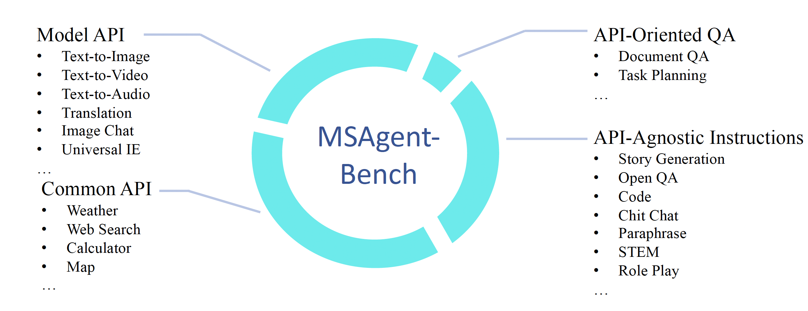

<h1> ModelScope-Agent: 基于开源大语言模型的可定制Agent系统</h1>
<p align="center">
    <br>
    
    <br>
<p>

<p align="center">
<a href="https://modelscope.cn/home">魔搭社区</a> ｜ <a href="https://arxiv.org/abs/2309.00986">论文</a> | <a href="https://modelscope.cn/studios/damo/ModelScopeGPT/summary">Demo体验</a>
<br>
        中文&nbsp ｜ &nbsp<a href="README.md">English</a>
</p>

<p align="center">

<a href="https://github.com/modelscope/modelscope-agent/"></a>
<a href="https://github.com/modelscope/modelscope-agent/actions?query=branch%3Amaster+workflow%3Acitest++"></a>
<a href="https://github.com/modelscope/modelscope-agent/blob/main/LICENSE"></a>
<a href="https://github.com/modelscope/modelscope-agent/pulls"></a>
</p>


## 简介

Modelscope-Agent是一个可定制的、可扩展的Agent代码框架。单Agent具有角色扮演、LLM调用、工具使用、规划、记忆等能力。 主要具有以下特点：

- 简单的Agent实现流程：仅需指定角色描述、LLM名称、工具名列表，即可实现一个Agent应用，框架内部自动实现工具使用、规划、记忆等工作流的编排。
- 丰富的模型和工具：框架内置丰富的LLM接口，例如Dashscope和Modelscope模型接口，OpenAI模型接口等。内置丰富的工具，例如**代码运行**、**天气查询**、**文生图**、**网页解析**等，方便定制专属Agent。
- 统一的接口和高扩展性：框架具有清晰的工具、LLM注册机制，方便用户扩展能力更加丰富的Agent应用。
- 低耦合性：开发者可以方便的直接使用内置的工具、LLM、记忆等组件，而不需要绑定更上层的Agent。


## 更新
* 2024.3。15: Modelscope-Agent 和 Agentfabric（面向GPT的开源版本）正在[modelscope studio](https://modelscope.cn/studios/agent)的生产环境中运行。
* 2024.2.10：在中国新年期间，我们将modelscope agent升级到v0.3版本，以便开发者通过编码更方便地定制各类agent，并使创建多agent演示变得更加容易。更多详情，您可以参考[#267](https://github.com/modelscope/modelscope-agent/pull/267) 和 [#293](https://github.com/modelscope/modelscope-agent/pull/293)。
* 2023.11.26: [AgentFabric](https://github.com/modelscope/modelscope-agent/tree/master/apps/agentfabric)支持ModelScope[创空间](https://modelscope.cn/studios/modelscope/AgentFabric/summary)多人使用，支持分享定制应用到创空间，更新到最新的[GTE](https://modelscope.cn/models/damo/nlp_gte_sentence-embedding_chinese-base/summary) text embedding。
* 2023.11.17: [AgentFabric](https://github.com/modelscope/modelscope-agent/tree/master/apps/agentfabric) 发布，这是一个交互式的智能体构建工具，用于方便地创建针对各种现实应用量身定制智能体。
* 2023.10.30: [Facechain Agent](https://modelscope.cn/studios/CVstudio/facechain_agent_studio/summary) 发布了人脸写真Agent本地版本，可以在本地运行，具体使用见[Facechain Agent](#facechain-agent)
* 2023.10.25: [Story Agent](https://modelscope.cn/studios/damo/story_agent/summary) 发布了故事绘本图文生成Agent本地版本，可以在本地运行，具体使用见[Story Agent](#story-agent)
* 2023.9.20: [ModelScope GPT](https://modelscope.cn/studios/damo/ModelScopeGPT/summary) gradio提供了本地版本，可以在本地运行，可以进入demo/msgpt/目录后执行`bash run_msgpt.sh`
* 2023.9.4: 三个基于Agent开发的应用，[demo_qwen](demo/demo_qwen_agent.ipynb), [demo_retrieval_agent](demo/demo_retrieval_agent.ipynb) and [demo_register_tool](demo/demo_register_new_tool.ipynb) 已添加，并提供了详细的教程。
* 2023.9.2: 与该项目相关的[论文](https://arxiv.org/abs/2309.00986) 已发布到arxiv。
* 2023.8.22: 支持使用 ModelScope 令牌访问各种 AI 模型 API。
* 2023.8.7: modelscope-agent仓库的初始版本已发布。

## 安装

克隆repo并安装依赖：
```shell
git clone https://github.com/modelscope/modelscope-agent.git
cd modelscope-agent && pip install -r requirements.txt
```


### 使用ModelScope提供的notebook环境【推荐】
ModelScope(魔搭社区)提供给新用户初始的免费计算资源，参考[ModelScope Notebook](https://modelscope.cn/my/mynotebook/preset)

Notebook环境使用简单，您只需要按以下步骤操作（注意：目前暂不提供永久存储，实例重启后数据会丢失）：

```shell
# Step1: 我的notebook -> PAI-DSW -> GPU环境

# Step2: 下载[demo文件](https://github.com/modelscope/modelscope-agent/blob/master/demo/demo_qwen_agent.ipynb)并把它上传到打开的notebook机器上

# Step3: 按顺序执行demo里面的代码块
```


## 快速入门

agent结合了大型语言模型（LLM）以及特定任务的工具，并利用LLM来确定为了完成用户任务需要调用哪个或哪些工具。

在一开始，您所需要做的就是使用相应的任务初始化一个`RolePlay`对象。

- 样本代码使用了 qwen-max 模型、绘图工具和天气预报工具。
     - 使用 qwen-max 模型需要将示例中的 YOUR_DASHSCOPE_API_KEY 替换为您的 API-KEY，以便代码正常运行。您的 YOUR_DASHSCOPE_API_KEY 可以在[这里](https://help.aliyun.com/zh/dashscope/developer-reference/activate-dashscope-and-create-an-api-key)获得。绘图工具也调用了 DASHSCOPE API（wanx），因此不需要额外配置。
     - 在使用天气预报工具时，需要将示例中的 YOUR_AMAP_TOKEN 替换为您的高德天气 API-KEY，以便代码能够正常运行。您的 YOUR_AMAP_TOKEN 可以在[这里](https://lbs.amap.com/api/javascript-api-v2/guide/services/weather)获得。

```Python
# 配置环境变量；如果您已经提前将api-key提前配置到您的运行环境中，可以省略这个步骤
import os
os.environ['DASHSCOPE_API_KEY']=YOUR_DASHSCOPE_API_KEY
os.environ['AMAP_TOKEN']=YOUR_AMAP_TOKEN

# 选用RolePlay 配置agent
from modelscope_agent.agents.role_play import RolePlay  # NOQA

role_template = '你扮演一个天气预报助手，你需要查询相应地区的天气，并调用给你的画图工具绘制一张城市的图。'

llm_config = {'model': 'qwen-max', 'model_server': 'dashscope'}

# input tool name
function_list = ['amap_weather', 'image_gen']

bot = RolePlay(
    function_list=function_list, llm=llm_config, instruction=role_template)

response = bot.run('朝阳区天气怎样？')

text = ''
for chunk in response:
    text += chunk
```

结果
- Terminal 运行
```shell
# 第一次调用llm的输出
Action: amap_weather
Action Input: {"location": "朝阳区"}

# 第二次调用llm的输出
目前，朝阳区的天气状况为阴天，气温为1度。

Action: image_gen
Action Input: {"text": "朝阳区城市风光", "resolution": "1024*1024"}

# 第三次调用llm的输出
目前，朝阳区的天气状况为阴天，气温为1度。同时，我已为你生成了一张朝阳区的城市风光图，如下所示：


```

### 主要组件

`Agent`对象包括以下组件：

- `LLM`：负责处理用户输入并决策调用合适工具。
- `function_list`：包含代理可用工具的列表。

我们为用户提供了这些组件的默认实现，但用户也可以根据自己的需求自定义组件。

目前，Agent 的配置可能包含以下参数：
- `llm`: 该代理的语言模型配置
    - 当为字典时：设置语言模型的配置为 {'model': '', 'api_key': '', 'model_server': ''}
    - 当为 BaseChatModel 时：语言模型由另一个agent发送
- `function_list`： 工具列表
    - 当为字符串时：工具名称
    - 当为字典时：工具配置
- `storage_path`： 如果没有另外指定，所有数据都将以键值对的形式存储在这里，通过内存
- `instruction`： 该agent的系统指令
- `name`: agent的名称
- `description`： agent的描述，用于multi_agent
- `kwargs`： 其他潜在参数

`agent` 作为一个基类，不能直接初始化和调用。代理的子类需要继承它。它们必须实现函数`_run`，主要包括三个部分：生成消息或提示，调用 llm（语言模型），以及基于 llm 结果的工具调用。我们为用户提供了`RolePlay`中这些组件的实现，您也可以根据您的需求自定义组件。

```python
from modelscope_agent import Agent
class YourCustomAgent(Agent):
    def _run(self, user_request, **kwargs):
        # 定制您的工作流程
```

### 配置

对于用户隐私相关的配置，如 `user_token` 等不应该公开，因此我们建议您使用 `dotenv` 包和 `.env` 文件来设置这些配置。

具体来说，我们提供了一个模版文件 `.env.template` ，用户可以复制并更改文件名为`.env` 来进行个人配置管理，

并通过 `load_dotenv(find_dotenv())` 来加载这些配置。 另外，用户也可以直接通过设置环境变量的方式来进行token的配置。

除此之外，我们还提供了一个模型配置文件模版 `cfg_model_template.json` ，和一个工具类配置文件模版 `cfg_tool_template.json`.

我们已经将默认的配置填入，用户可以直接使用，也可以复制并更改文件名，进行深度定制。

### LLM

LLM 是代理的核心模块，它确保了交互结果的质量。

目前，LLM 的配置可能包含以下参数:
- `model`: 特定的模型名称，将直接传递给模型服务提供商。
- `model_server`: 模型服务的提供商。

`BaseChatModel`作为 LLM 的基类，不能直接初始化和调用。子类需要继承它。它们必须分别实现函数 `_chat_stream` 和 `_chat_no_stream`，这两个函数分别对应流式输出和非流式输出。
可选实现 `chat_with_functions` 和 `chat_with_raw_prompt` 函数，用于调用功能和文本补全。

目前我们提供了三个模型服务提供商的实现：dashscope（用于 qwen 系列模型）、zhipu（用于 glm 系列模型）和 openai（用于所有 openai api 格式模型）。您可以直接使用上述服务提供商支持的模型，或者您可以定制您自己的 LLM。

有关更多信息，请参阅`docs/modules/llm.md`

有关本地部署的更多信息，请参阅`docs/local_deploy.md`

### 自定义工具

我们提供了几种多领域工具，可以在agent中配置和使用。 您也可以通过继承基础工具，并根据预定义的模式设置工具的名称、描述和参数来自定义您的工具。根据您的需要，可以实现 call() 函数。 一个自定义工具的例子提供在
以下是支持的工具示例：
[demo_register_new_tool](../demo/demo_register_new_tool.ipynb)

您可以将您想要使用的工具名称或配置传递给agent。

```python
# by tool name
function_list = ['amap_weather', 'image_gen']
bot = RolePlay(function_list=function_list, ...)

# by tool configuration
from langchain.tools import ShellTool
function_list = [{'terminal':ShellTool()}]
bot = RolePlay(function_list=function_list, ...)

# by mixture
function_list = ['amap_weather', {'terminal':ShellTool()}]
bot = RolePlay(function_list=function_list, ...)
```

#### Built-in tools
- `image_gen`: [Wanx 图像生成](https://help.aliyun.com/zh/dashscope/developer-reference/tongyi-wanxiang). [DASHSCOPE_API_KEY](https://help.aliyun.com/zh/dashscope/developer-reference/activate-dashscope-and-create-an-api-key) 需要在环境变量中进行配置。
- `code_interpreter`: [代码解释器](https://jupyter-client.readthedocs.io/en/5.2.2/api/client.html)
- `web_browser`: [网页浏览](https://python.langchain.com/docs/use_cases/web_scraping)
- `amap_weather`: [高德天气](https://lbs.amap.com/api/javascript-api-v2/guide/services/weather). AMAP_TOKEN 需要在环境变量中进行配置。
- `wordart_texture_generation`: [艺术字纹理生成](https://help.aliyun.com/zh/dashscope/developer-reference/wordart). [DASHSCOPE_API_KEY](https://help.aliyun.com/zh/dashscope/developer-reference/activate-dashscope-and-create-an-api-key) 需要在环境变量中进行配置。
- `web_search`: [网页搜索](https://learn.microsoft.com/en-us/bing/search-apis/bing-web-search/overview). []
- `qwen_vl`: [Qwen-VL 图像识别](https://help.aliyun.com/zh/dashscope/developer-reference/tongyi-qianwen-vl-plus-api). [DASHSCOPE_API_KEY](https://help.aliyun.com/zh/dashscope/developer-reference/activate-dashscope-and-create-an-api-key) 需要在环境变量中进行配置。
- `style_repaint`: [字符样式重绘](https://help.aliyun.com/zh/dashscope/developer-reference/tongyi-wanxiang-style-repaint). [DASHSCOPE_API_KEY](https://help.aliyun.com/zh/dashscope/developer-reference/activate-dashscope-and-create-an-api-key) 需要在环境变量中进行配置。
- `image_enhancement`: [追影放大镜](https://github.com/dreamoving/Phantom). [DASHSCOPE_API_KEY](https://help.aliyun.com/zh/dashscope/developer-reference/activate-dashscope-and-create-an-api-key) 需要在环境变量中进行配置。
- `text-address`: [地理编码](https://www.modelscope.cn/models/iic/mgeo_geographic_elements_tagging_chinese_base/summary). [MODELSCOPE_API_TOKEN](https://www.modelscope.cn/my/myaccesstoken) 需要在环境变量中进行配置。
- `speech-generation`: [语音生成](https://www.modelscope.cn/models/iic/speech_sambert-hifigan_tts_zh-cn_16k/summary). [MODELSCOPE_API_TOKEN](https://www.modelscope.cn/my/myaccesstoken) 需要在环境变量中进行配置。
- `video-generation`: [视频生成](https://www.modelscope.cn/models/iic/text-to-video-synthesis/summary). [MODELSCOPE_API_TOKEN](https://www.modelscope.cn/my/myaccesstoken) 需要在环境变量中进行配置。

## 训练框架

我们在[demo/tool_agent_finetune_swift](demo/tool_agent_finetune_swift)中提供了一个开源大模型训练框架，主要集成了来自ModelScope的SWIFT训练框架。此外，我们还发布了一个大规模的工具指令微调数据集MSAgent-Bench。

### MSAgent-Bench数据集

[MSAgent-Bench](https://modelscope.cn/datasets/damo/MSAgent-Bench/summary)是一个包含598k个对话的综合工具数据集，包括通用API、模型API、面向API的问答和与API无关的指令。您可以直接在数据集[链接](https://modelscope.cn/datasets/damo/MSAgent-Bench/files)上下载它，或通过SDK访问：

```python
from modelscope.msdatasets import MsDataset

ds = MsDataset.load('damo/MSAgent-Bench', split='train')
one_ds = next(iter(ds))
```



### 训练微调

训练样本可以组织成以下形式，其中：<|startofthink|>和<|endofthink|>之间包含的是API请求生成内容，<|startofexec|>和<|endofexec|>之间包含的是API执行结果。

```json
{
    "id":"MS_Agent_Bench_20",
    "conversations":[
        {
            "from":"system",
            "value": "你是达摩院xxxx"
        },
        {
            "from":"user",
            "value":"按照给定的schema抽取出下面文本对应的信息\nschema：{\"人物\": null, \"地理位置\": null, \"组织机构\": null}\n近日，美国政府宣布将对中国1000多种商品加征关税，并威胁进一步加征关税。"
        },
        {
            "from":"assistant",
            "value":"<|startofthink|>```JSON\n{\"api_name\": \"modelscope_text-ie\", \"url\": \"http://9.32.64.200:5873/damo/nlp_structbert_siamese-uie_chinese-base\", \"parameters\": {\"text\": \"近日，美国政府宣布将对中国1000多种商品加征关税，并威胁进一步加征关税。\", \"schema\": \"{\\\"人物\\\": null, \\\"地理位置\\\": null, \\\"组织机构\\\": null}\"}}\n```<|endofthink|>\n\n<|startofexec|>```JSON\n{\"人物\": [], \"地理位置\": [\"中国\", \"美国\"], \"组织机构\": []}\n```<|endofexec|>\n信息抽取结果：{\"人物\": [], \"地理位置\": [\"中国\", \"美国\"], \"组织机构\": []}。"
        }
    ]
}
```

执行下面这个脚本训练模型

```
cd demo/tool_agent_finetune_swift
PYTHONPATH=./ bash scripts/train/run_qwen_ddp.sh
```

## 相关教程

如果您还想进一步了解Agent细节，可以参考我们的文章和视频教程

* [文章教程](https://mp.weixin.qq.com/s/L3GiV2QHeybhVZSg_g_JRw)
* [视频教程](https://b23.tv/AGIzmHM)

## 分享您的Agent

我们感谢您对参与我们的开源ModelScope-Agent项目的热情。如果您遇到任何问题，请随时向我们提问。如果您已经构建了一个新的Agent Demo并准备与我们分享您的工作，请随时创建一个pull请求！如果您需要任何进一步的帮助，请邮件[contact@modelscope.cn](mailto:contact@modelscope.cn)或者交流群[联系我们](https://modelscope.cn/docs/%E8%81%94%E7%B3%BB%E6%88%91%E4%BB%AC)

### Facechain Agent
Facechain是一个开源的人脸写真项目，用户上传几张图片就可以生成各种风格的个人写真，我们通过modelscope-agent框架，接入facechain的能力，极大的简化了使用流程，通过对话的方式即可完成人脸写真

FaceChainAgent创空间应用地址：https://modelscope.cn/studios/CVstudio/facechain_agent_studio/summary

可以直接在notebook/colab/本地中运行：https://www.modelscope.cn/my/mynotebook

```
! git clone -b feat/facechain_agent https://github.com/modelscope/modelscope-agent.git

! cd modelscope-agent && ! pip install -r requirements.txt
! cd modelscope-agent/demo/facechain_agent/demo/facechain_agent && ! pip install -r requirements.txt
! pip install http://dashscope-cn-beijing.oss-cn-beijing.aliyuncs.com/zhicheng/modelscope_agent-0.1.0-py3-none-any.whl
! PYTHONPATH=/mnt/workspace/modelscope-agent/demo/facechain_agent && cd modelscope-agent/demo/facechain_agent/demo/facechain_agent && python app_v1.0.py
```

### Story Agent
Story Agent是一个开源的故事绘本生成智能体，用户通过对话交流的方式即可完成一个绘本的创作，整个流程Agent会智能的引导用户如何创作绘本


StoryAgent 创空间应用地址：https://modelscope.cn/studios/damo/story_agent/summary

也可以直接在notebook中运行：https://www.modelscope.cn/my/mynotebook

```
! git clone -b feat/story_agent_gradio https://github.com/modelscope/modelscope-agent.git

import os
os.environ['DASHSCOPE_API_KEY'] = '替换成你的'
#DASHSCOPE_API_KEY可以从dashscope网站 https://dashscope.console.aliyun.com/apiKey获取
! cd modelscope-agent && ! pip install -r requirements.txt
! cd modelscope-agent/demo/story_agent && ! pip install -r requirement_gr.txt
! cd modelscope-agent/demo/story_agent && ! sh run_story_agent.sh
```

## 引用
如果您觉得这个工作很有用，请考虑给这个项目加星，并引用我们的论文，感谢：
```
@misc{li2023modelscopeagent,
      title={ModelScope-Agent: Building Your Customizable Agent System with Open-source Large Language Models},
      author={Chenliang Li and Hehong Chen and Ming Yan and Weizhou Shen and Haiyang Xu and Zhikai Wu and Zhicheng Zhang and Wenmeng Zhou and Yingda Chen and Chen Cheng and Hongzhu Shi and Ji Zhang and Fei Huang and Jingren Zhou},
      year={2023},
      eprint={2309.00986},
      archivePrefix={arXiv},
      primaryClass={cs.CL}
}
```

## License

本项目使用 [Apache License (Version 2.0)](https://github.com/modelscope/modelscope/blob/master/LICENSE)进行许可。


## Star History

[](https://star-history.com/#modelscope/modelscope-agent&Date)
