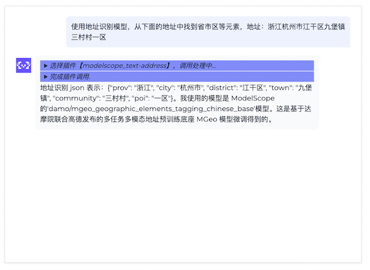
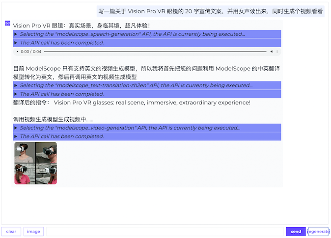
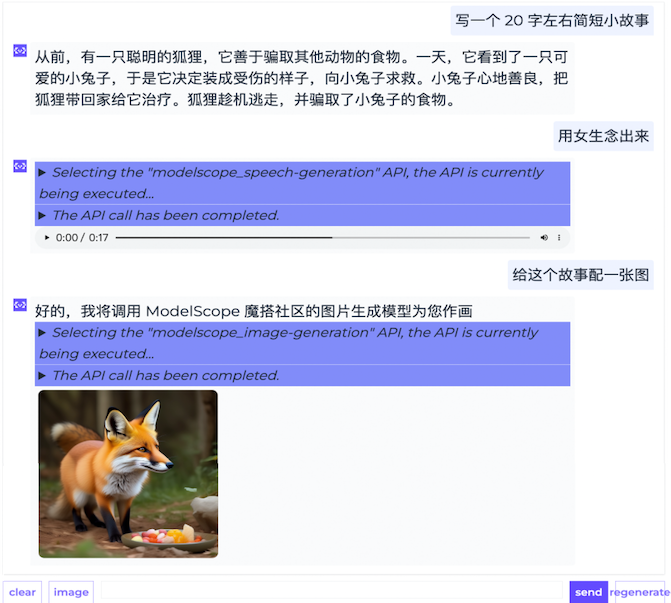
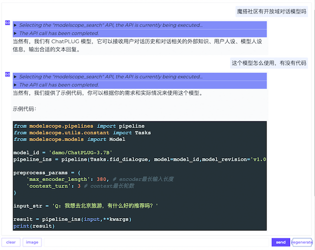

<h1> ModelScope-Agent: 基于开源大语言模型的可定制Agent系统</h1>
<p align="center">
    <br>
    
    <br>
<p>

<p align="center">
<a href="https://modelscope.cn/home">魔搭社区</a> ｜ <a href="https://arxiv.org/abs/2309.00986">论文</a> | <a href="https://modelscope.cn/studios/damo/ModelScopeGPT/summary">Demo体验</a>
<br>
        中文&nbsp ｜ &nbsp<a href="README.md">English</a>
</p>

<p align="center">

<a href="https://github.com/modelscope/modelscope-agent/"></a>
<a href="https://github.com/modelscope/modelscope-agent/actions?query=branch%3Amaster+workflow%3Acitest++"></a>
<a href="https://github.com/modelscope/modelscope-agent/blob/main/LICENSE"></a>
<a href="https://github.com/modelscope/modelscope-agent/pulls"></a>
</p>


## 简介

Modelscope-Agent是一个可定制的、可扩展的Agent代码框架。单Agent具有角色扮演、LLM调用、工具使用、规划、记忆等能力。 主要具有以下特点：

- 简单的Agent实现流程：仅需指定角色描述、LLM名称、工具名列表，即可实现一个Agent应用，框架内部自动实现工具使用、规划、记忆等工作流的编排。
- 丰富的模型和工具：框架内置丰富的LLM接口，例如Dashscope和Modelscope模型接口，OpenAI模型接口等。内置丰富的工具，例如**代码运行**、**天气查询**、**文生图**、**网页解析**等，方便定制专属Agent。
- 统一的接口和高扩展性：框架具有清晰的工具、LLM注册机制，方便用户扩展能力更加丰富的Agent应用。
- 低耦合性：开发者可以方便的直接使用内置的工具、LLM、记忆等组件，而不需要绑定更上层的Agent。


##  🎉更新
* 🔥2024.3.15: 基于[Ray](https://docs.ray.io/en/latest/)的multi-agent方案正式上线，参考[文档](https://github.com/modelscope/modelscope-agent/tree/master/modelscope_agent/multi_agents_tasks/README_CN.md)
* 🔥2024.3.13: 基于modelscope-agent的[AgentFabric](https://github.com/modelscope/modelscope-agent/tree/master/apps/agentfabric)已经正式进入Modelscope[创空间](https://modelscope.cn/studios/agent)生成环境。
* 2024.2.10：在中国新年期间，我们将modelscope agent升级到v0.3版本，以便开发者通过编码更方便地定制各类agent，并使创建多agent演示变得更加容易。更多详情，您可以参考[#267](https://github.com/modelscope/modelscope-agent/pull/267) 和 [#293](https://github.com/modelscope/modelscope-agent/pull/293)。
* 2023.11.26: [AgentFabric](https://github.com/modelscope/modelscope-agent/tree/master/apps/agentfabric)支持ModelScope[创空间](https://modelscope.cn/studios/modelscope/AgentFabric/summary)多人使用，支持分享定制应用到创空间，更新到最新的[GTE](https://modelscope.cn/models/damo/nlp_gte_sentence-embedding_chinese-base/summary) text embedding。
* 2023.11.17: [AgentFabric](https://github.com/modelscope/modelscope-agent/tree/master/apps/agentfabric) 发布，这是一个交互式的智能体构建工具，用于方便地创建针对各种现实应用量身定制智能体。
* 2023.10.30: [Facechain Agent](https://modelscope.cn/studios/CVstudio/facechain_agent_studio/summary) 发布了人脸写真Agent本地版本，可以在本地运行，具体使用见[Facechain Agent](#facechain-agent)
* 2023.10.25: [Story Agent](https://modelscope.cn/studios/damo/story_agent/summary) 发布了故事绘本图文生成Agent本地版本，可以在本地运行，具体使用见[Story Agent](#story-agent)
* 2023.9.20: [ModelScope GPT](https://modelscope.cn/studios/damo/ModelScopeGPT/summary) gradio提供了本地版本，可以在本地运行，可以进入demo/msgpt/目录后执行`bash run_msgpt.sh`
* 2023.9.4: 三个基于Agent开发的应用，[demo_qwen](demo/demo_qwen_agent.ipynb), [demo_retrieval_agent](demo/demo_retrieval_agent.ipynb) and [demo_register_tool](demo/demo_register_new_tool.ipynb) 已添加，并提供了详细的教程。
* 2023.9.2: 与该项目相关的[论文](https://arxiv.org/abs/2309.00986) 已发布到arxiv。
* 2023.8.22: 支持使用 ModelScope 令牌访问各种 AI 模型 API。
* 2023.8.7: modelscope-agent仓库的初始版本已发布。

## 安装

克隆repo并安装依赖：
```shell
git clone https://github.com/modelscope/modelscope-agent.git
cd modelscope-agent && pip install -r requirements.txt
```


### 使用ModelScope提供的notebook环境【推荐】
ModelScope(魔搭社区)提供给新用户初始的免费计算资源，参考[ModelScope Notebook](https://modelscope.cn/my/mynotebook/preset)

Notebook环境使用简单，您只需要按以下步骤操作（注意：目前暂不提供永久存储，实例重启后数据会丢失）：

```shell
# Step1: 我的notebook -> PAI-DSW -> GPU环境

# Step2: 下载[demo文件](https://github.com/modelscope/modelscope-agent/blob/master/demo/demo_qwen_agent.ipynb)并把它上传到打开的notebook机器上

# Step3: 按顺序执行demo里面的代码块
```


## 快速入门

使用 ModelScope-Agent，您只需要实例化一个 `Agent` 对象，并使用 `run()` 来执行您的任务即可。

如下简单示例，更多细节可参考[demo_agent](demo/demo_qwen_agent.ipynb)。也可通过魔搭社区在线Demo直接体验[ModelScope](https://modelscope.cn/studios/damo/ModelScopeGPT/summary).

```Python
from modelscope_agent.agents import RolePlay

# config
role_template = '你扮演一个天气预报助手，你需要查询相应地区的天气，并调用给你的画图工具绘制一张城市的图。'
llm_config = {'model': 'qwen-max', 'model_server': 'dashscope'}
function_list = ['amap_weather', 'image_gen']

# init agent
bot = RolePlay(function_list=function_list, llm=llm_config, instruction=role_template)

# run agent
response = bot.run('朝阳区天气怎样？')

# result processing
text = ''
for chunk in response:
    text += chunk
print(text)


```

- 单步 & 多步工具使用

```Python
# Single-step tool-use
agent.run("I want to see cute kittens", remote=True)

# Multi-step tool-use
print('The built-in voice generation and video generation capabilities are deployed in mdoelscope. You need to enter the ModelScope Token, which can be obtained from here: https://modelscope.cn/my/myaccesstoken')
os.environ['MODELSCOPE_API_TOKEN'] = input()

agent.reset()
agent.run('写一篇关于Vision Pro VR眼镜的20字宣传文案，并用女声读出来，同时生成个视频看看', remote=True)
```

<div style="display: flex;">
  
  
</div>

- 多轮工具使用和知识问答

```Python
# Multi-turn tool-use
agent.reset()
agent.run('写一个20字左右简短的小故事', remote=True)
agent.run('用女声念出来', remote=True)
agent.run('给这个故事配一张图', remote=True)
```

<div style="display: flex;">
  
  
</div>

### 主要组件

`AgentExecutor`对象包括以下组件：

- `LLM`：负责处理用户输入并决策调用合适工具。
- `tool_list`：包含代理可用工具的列表。
- `PromptGenerator`：提示词管理组件，将 `prompt_template`、`user_input`、`history`、`tool_list` 等整合到高效的提示词中。
- `OutputParser`：输出模块，将LLM响应解析为要调用的工具和相应的参数。

我们为用户提供了这些组件的默认实现，但用户也可以根据自己的需求自定义组件。


### 配置

对于用户隐私相关的配置，如 `user_token` 等不应该公开，因此我们建议您使用 `dotenv` 包和 `.env` 文件来设置这些配置。

具体来说，我们提供了一个模版文件 `.env.template` ，用户可以复制并更改文件名为`.env` 来进行个人配置管理，

并通过 `load_dotenv(find_dotenv())` 来加载这些配置。 另外，用户也可以直接通过设置环境变量的方式来进行token的配置。

除此之外，我们还提供了一个模型配置文件模版 `cfg_model_template.json` ，和一个工具类配置文件模版 `cfg_tool_template.json`.

我们已经将默认的配置填入，用户可以直接使用，也可以复制并更改文件名，进行深度定制。

### LLM

我们提供了开箱即用的LLM方便用户使用，具体模型如下：
* modelscope-agent-7b: [modelscope-agent-7b](https://modelscope.cn/models/damo/ModelScope-Agent-7B/summary)是驱动ModelScope-Agent框架的核心开源模型，可以直接下载到本地使用。
* modelscope-agent: 部署在[DashScope](http://dashscope.aliyun.com)上的ModelScope-Agent服务，不需要本地GPU资源，在DashScope平台执行如下操作：
    1. 申请开通DashScope服务，进入`模型广场`-> `通义千问开源系列` -> 申请试用`通义千问7B`， 免费额度为10万token
    2. `API-kEY管理`中创建API-KEY，在`config/.env`文件中配置


如果用户想使用其他LLM，也可以继承基类并专门实现 `generate()` 或 `stream_generate()`。

- `generate()`: 直接返回最终结果
- `stream_generate()`: 返回一个生成器用于结果的串行生成，在部署应用程序到 Gradio 时可以使用。

用户还可以使用 ModelScope 或 Huggingface 的开源LLM，并通过 `LLMFactory` 类在本地进行推断。此外，也可以使用用户的数据集对这些模型进行微调或加载您的自定义权重。

```Python
# 本地LLM配置
import os
from modelscope.utils.config import Config
from modelscope_agent.llm import LLMFactory
from modelscope_agent.agent import AgentExecutor

model_name = 'modelscope-agent-7b'
model_cfg = {
  'modelscope-agent-7b': {
    'type': 'modelscope',
    'model_id': 'damo/ModelScope-Agent-7B',
    'model_revision': 'v1.0.0',
    'use_raw_generation_config': True,
    'custom_chat': True
  }
}

tool_cfg_file = os.getenv('TOOL_CONFIG_FILE', 'config/cfg_tool_template.json')
tool_cfg = Config.from_file(tool_cfg_file)

llm = LLMFactory.build_llm(model_name, model_cfg)
agent = AgentExecutor(llm, tool_cfg)
```


### 自定义工具

为了能支持各类任务应用，我们提供了多个默认的pipeline作为工具以便大模型调用，这些pipeline来自于modelscope，涵盖了多个领域。

此外，用户可以通过继承基础的工具类，并根据定义名称、描述和参数(`names, descriptions, and parameters`)来自定义自己的工具。

同时还可以根据需要实现 `_local_call()` 或 `_remote_call()`。 更多工具类的注册细节可参考[tool](docs/modules/tool.md)和[too_demo](demo/demo_register_new_tool.ipynb)。

以下是支持的工具示例：

- 文本转语音工具

```python
from modelscope_agent.tools import ModelscopePipelineTool
from modelscope.utils.constant import Tasks
from modelscope_agent.output_wrapper import AudioWrapper


class TexttoSpeechTool(ModelscopePipelineTool):
    default_model = 'damo/speech_sambert-hifigan_tts_zh-cn_16k'
    description = '文本转语音服务，将文字转换为自然而逼真的语音，可配置男声/女声'
    name = 'modelscope_speech-generation'
    parameters: list = [{
        'name': 'input',
        'description': '要转成语音的文本',
        'required': True
    }, {
        'name': 'gender',
        'description': '用户身份',
        'required': True
    }]
    task = Tasks.text_to_speech

    def _remote_parse_input(self, *args, **kwargs):
        if 'gender' not in kwargs:
            kwargs['gender'] = 'man'
        voice = 'zhibei_emo' if kwargs['gender'] == 'man' else 'zhiyan_emo'
        kwargs['parameters'] = voice
        kwargs.pop('gender')
        return kwargs

    def _parse_output(self, origin_result, remote=True):
        audio = origin_result['output_wav']
        return {'result': AudioWrapper(audio)}
```

- 文本地址工具

```python
from modelscope_agent.tools import ModelscopePipelineTool
from modelscope.utils.constant import Tasks


class TextAddressTool(ModelscopePipelineTool):
    default_model = 'damo/mgeo_geographic_elements_tagging_chinese_base'
    description = '地址解析服务，针对中文地址信息，识别出里面的元素，包括省、市、区、镇、社区、道路、路号、POI、楼栋号、户室号等'
    name = 'modelscope_text-address'
    parameters: list = [{
        'name': 'input',
        'description': '用户输入的地址信息',
        'required': True
    }]
    task = Tasks.token_classification

    def _parse_output(self, origin_result, *args, **kwargs):
        final_result = {}
        for e in origin_result['output']:
            final_result[e['type']] = e['span']
        return final_result
```

此外，如果用户希望使用来自`langchain`的工具，我们也为用户提供了便捷接口。用户可以直接使用 `LangchainTool` 来进行调用。 具体如下：

```Python

from modelscope_agent.tools import LangchainTool
from langchain.tools import ShellTool

# 包装 langchain 工具
shell_tool = LangchainTool(ShellTool())

print(shell_tool(commands=["echo 'Hello World!'", "ls"]))

```

### Multi-Agent
请参考相关[文档](modelscope_agent/multi_agents_tasks/README_CN.md)。

## 训练框架

我们在[demo/tool_agent_finetune_swift](demo/tool_agent_finetune_swift)中提供了一个开源大模型训练框架，主要集成了来自ModelScope的SWIFT训练框架。此外，我们还发布了一个大规模的工具指令微调数据集MSAgent-Bench。

### MSAgent-Bench数据集

[MSAgent-Bench](https://modelscope.cn/datasets/damo/MSAgent-Bench/summary)是一个包含598k个对话的综合工具数据集，包括通用API、模型API、面向API的问答和与API无关的指令。您可以直接在数据集[链接](https://modelscope.cn/datasets/damo/MSAgent-Bench/files)上下载它，或通过SDK访问：

```python
from modelscope.msdatasets import MsDataset

ds = MsDataset.load('damo/MSAgent-Bench', split='train')
one_ds = next(iter(ds))
```


### 训练微调

训练样本可以组织成以下形式，其中：<|startofthink|>和<|endofthink|>之间包含的是API请求生成内容，<|startofexec|>和<|endofexec|>之间包含的是API执行结果。

```json
{
    "id":"MS_Agent_Bench_20",
    "conversations":[
        {
            "from":"system",
            "value": "你是达摩院xxxx"
        },
        {
            "from":"user",
            "value":"按照给定的schema抽取出下面文本对应的信息\nschema：{\"人物\": null, \"地理位置\": null, \"组织机构\": null}\n近日，美国政府宣布将对中国1000多种商品加征关税，并威胁进一步加征关税。"
        },
        {
            "from":"assistant",
            "value":"<|startofthink|>```JSON\n{\"api_name\": \"modelscope_text-ie\", \"url\": \"http://9.32.64.200:5873/damo/nlp_structbert_siamese-uie_chinese-base\", \"parameters\": {\"text\": \"近日，美国政府宣布将对中国1000多种商品加征关税，并威胁进一步加征关税。\", \"schema\": \"{\\\"人物\\\": null, \\\"地理位置\\\": null, \\\"组织机构\\\": null}\"}}\n```<|endofthink|>\n\n<|startofexec|>```JSON\n{\"人物\": [], \"地理位置\": [\"中国\", \"美国\"], \"组织机构\": []}\n```<|endofexec|>\n信息抽取结果：{\"人物\": [], \"地理位置\": [\"中国\", \"美国\"], \"组织机构\": []}。"
        }
    ]
}
```

执行下面这个脚本训练模型

```
cd demo/tool_agent_finetune_swift
PYTHONPATH=./ bash scripts/train/run_qwen_ddp.sh
```

## 相关教程

如果您还想进一步了解Agent细节，可以参考我们的文章和视频教程

* [文章教程](https://mp.weixin.qq.com/s/L3GiV2QHeybhVZSg_g_JRw)
* [视频教程](https://b23.tv/AGIzmHM)

## 分享您的Agent

我们感谢您对参与我们的开源ModelScope-Agent项目的热情。如果您遇到任何问题，请随时向我们提问。如果您已经构建了一个新的Agent Demo并准备与我们分享您的工作，请随时创建一个pull请求！如果您需要任何进一步的帮助，请邮件[contact@modelscope.cn](mailto:contact@modelscope.cn)或者交流群[联系我们](https://modelscope.cn/docs/%E8%81%94%E7%B3%BB%E6%88%91%E4%BB%AC)

### Facechain Agent
Facechain是一个开源的人脸写真项目，用户上传几张图片就可以生成各种风格的个人写真，我们通过modelscope-agent框架，接入facechain的能力，极大的简化了使用流程，通过对话的方式即可完成人脸写真

FaceChainAgent创空间应用地址：https://modelscope.cn/studios/CVstudio/facechain_agent_studio/summary

可以直接在notebook/colab/本地中运行：https://www.modelscope.cn/my/mynotebook

```
! git clone -b feat/facechain_agent https://github.com/modelscope/modelscope-agent.git

! cd modelscope-agent && ! pip install -r requirements.txt
! cd modelscope-agent/demo/facechain_agent/demo/facechain_agent && ! pip install -r requirements.txt
! pip install http://dashscope-cn-beijing.oss-cn-beijing.aliyuncs.com/zhicheng/modelscope_agent-0.1.0-py3-none-any.whl
! PYTHONPATH=/mnt/workspace/modelscope-agent/demo/facechain_agent && cd modelscope-agent/demo/facechain_agent/demo/facechain_agent && python app_v1.0.py
```

### Story Agent
Story Agent是一个开源的故事绘本生成智能体，用户通过对话交流的方式即可完成一个绘本的创作，整个流程Agent会智能的引导用户如何创作绘本


StoryAgent 创空间应用地址：https://modelscope.cn/studios/damo/story_agent/summary

也可以直接在notebook中运行：https://www.modelscope.cn/my/mynotebook

```
! git clone -b feat/story_agent_gradio https://github.com/modelscope/modelscope-agent.git

import os
os.environ['DASHSCOPE_API_KEY'] = '替换成你的'
#DASHSCOPE_API_KEY可以从dashscope网站 https://dashscope.console.aliyun.com/apiKey获取
! cd modelscope-agent && ! pip install -r requirements.txt
! cd modelscope-agent/demo/story_agent && ! pip install -r requirement_gr.txt
! cd modelscope-agent/demo/story_agent && ! sh run_story_agent.sh
```

## 引用
如果您觉得这个工作很有用，请考虑给这个项目加星，并引用我们的论文，感谢：
```
@misc{li2023modelscopeagent,
      title={ModelScope-Agent: Building Your Customizable Agent System with Open-source Large Language Models},
      author={Chenliang Li and Hehong Chen and Ming Yan and Weizhou Shen and Haiyang Xu and Zhikai Wu and Zhicheng Zhang and Wenmeng Zhou and Yingda Chen and Chen Cheng and Hongzhu Shi and Ji Zhang and Fei Huang and Jingren Zhou},
      year={2023},
      eprint={2309.00986},
      archivePrefix={arXiv},
      primaryClass={cs.CL}
}
```

## License

本项目使用 [Apache License (Version 2.0)](https://github.com/modelscope/modelscope/blob/master/LICENSE)进行许可。


## Star History

[](https://star-history.com/#modelscope/modelscope-agent&Date)
