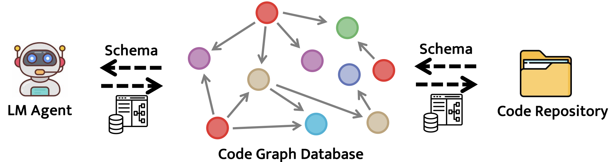
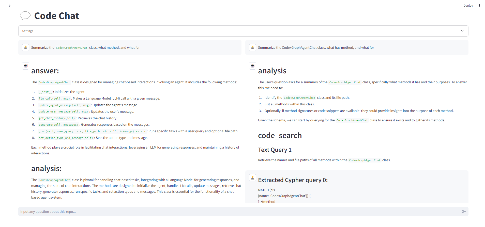
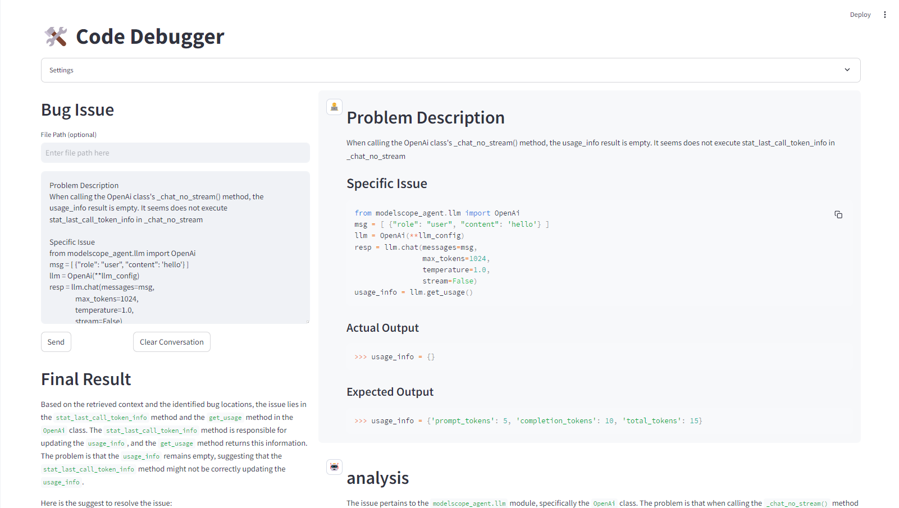
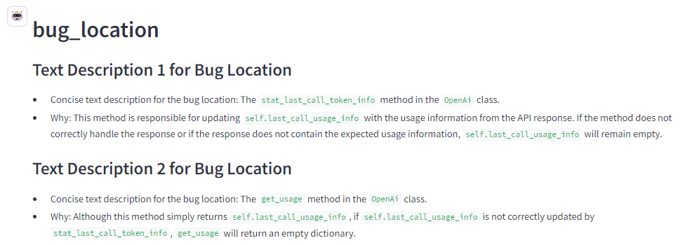
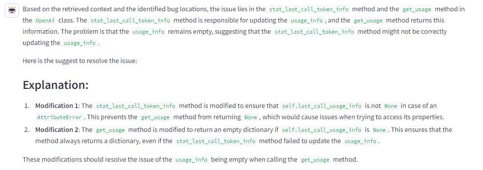
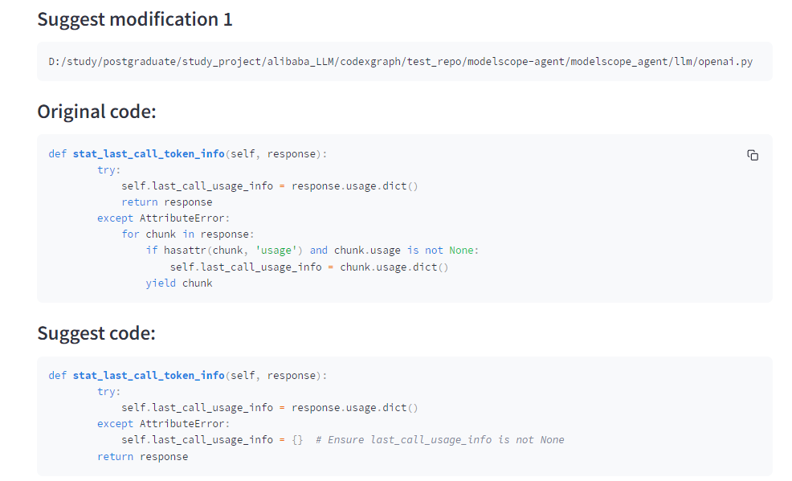
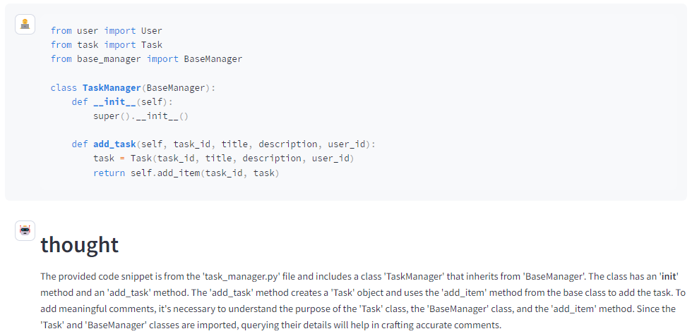
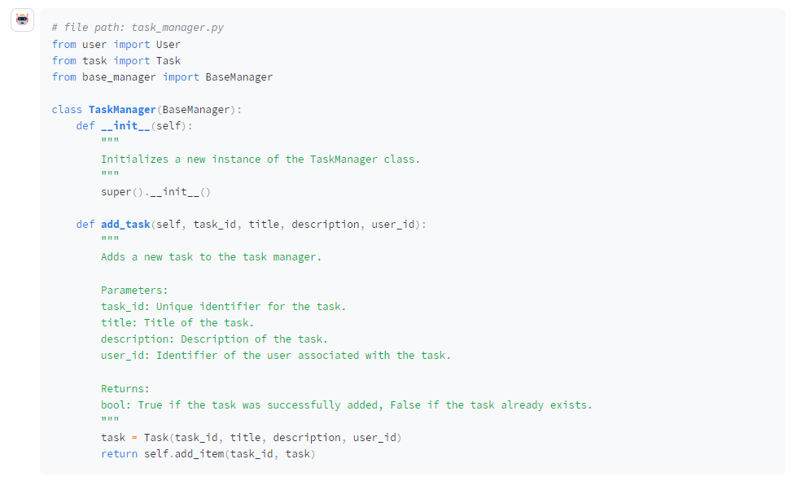
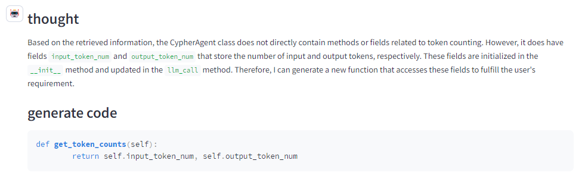
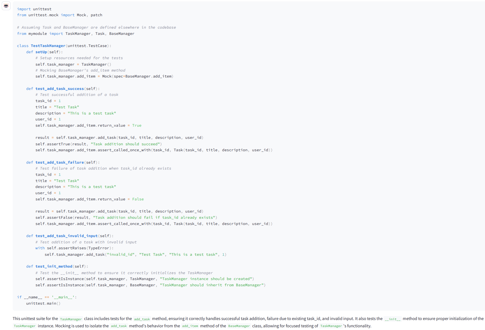

# 🌟✨ CodexGraph 🌟✨

<p align="center">
  
</p>
<p align="center">
  <a href="https://www.arxiv.org/abs/2408.03910"><strong>ArXiv Paper</strong></a>
  &nbsp;&nbsp;&nbsp;&nbsp;&nbsp;&nbsp;
  <a href="https://laptype.github.io/CodexGraph-page/"><strong>Webpage</strong></a>
</p>


## 📘 Introduction
**CodexGraph** is an advanced multi-tasking agent that integrates a language model (LM) agent with a code graph database interface. By utilizing the structural characteristics of graph databases and the versatility of the Cypher query language, CodexGraph enables the LM agent to formulate and execute multi-step queries. This capability allows for precise context retrieval and code navigation that is aware of the code's structure.


## 🚀 How to Use

### 1️⃣ Set Up Main Environment
- Install Neo4j Desktop:
  - Download and install [Neo4j Desktop](https://neo4j.com/download/)
  - Set the password for the default user `neo4j`
  - Create a new project and install a new database with database name `codexgraph`
  - Get bolt port as url from the database settings, typically it is `bolt://localhost:7687`


- Install dependencies:

```bash
pip install -r requirements.txt
```

### 2️⃣ Setup a separate python environment for Graph Database Environment
- Build the graph database environment:
Create a separate `Python<=3.9` environment and install the required dependencies:
```bash
conda create --name index_build python=3.9

conda activate myenv

pip install -r build_requirements.txt
```
This separate environment is caused by some packages in `build_requirements.txt` that are incompatible with the main environment.

- Find the Python path in this environment on Mac/Linux:
```bash
which python
```
or on Windows:
```bash
where python
```
The python executable will be used later.

### 3️⃣ Run CodexGraph Agent
- Navigate to the modelscope-agent directory:
```bash
cd modelscope-agent
```
- Run the CodexGraph Agent:
```bash
python apps\codexgraph_agent\run.py
```

## 📂 Example Usage
### 📑 code chat:
**Code Chat** allows users to inquire about a code repository, providing insights into code structure and function usage. This functionality is particularly useful for understanding complex codebases, identifying dependencies, and exploring the usage of specific classes, methods, and functions.

Here is an example of **Code Chat**. The user's question is: "Summarize the `CodexGraphAgentChat` class, what methods it has, and what they are for."



Once the necessary information is gathered, **Code Chat** constructs a comprehensive response to the user’s question. This response includes a summary of the `CodexGraphAgentChat` class, a list of its methods, and a description of what each method does.

### 🔍 code debug:

The **Code Debugger** diagnoses and resolves bugs by applying iterative reasoning and information retrieval to suggest targeted fixes. It utilizes Cypher queries to analyze the code repository, identify the cause of the issue, and recommend precise modifications.

Here is an example of **Code Debugger**. The user’s input is a real issue where the outcome does not match the expected behavior. The **Code Debugger** first analyzes the problem, then uses Cypher queries to retrieve relevant information and infer the cause of the bug. Finally, it provides an explanation of the bug and suggests the location for the modification.



Identifying the precise location of the bug in the codebase and providing a detailed explanation of the issue and the underlying cause of the bug.





Finally, **Code Debugger** will suggest modifications to ensure the bug is resolved.




### 📑 code add comment:
The **Code Commentor** analyzes code to provide detailed comments, enhancing code readability and maintainability. It leverages the code graph database to understand the code’s structure and behavior, ensuring accurate and informative comments.



By using Cypher queries, the specific implementation of the return function was obtained, and the return type was clarified.




### 📑 code generate:

The user has requested a function to retrieve the number of input and output tokens of `CypherAgent`. However, the challenge is identifying the corresponding fields within `CypherAgent` as this information is not provided in the user’s input.


First, **Code Generator** will consider the thought process in determining how to identify the relevant fields. Then, by using Cypher queries, it was discovered that the corresponding fields are `input_token_num` and `output_token_num`, which enables the generation of the correct code.




### 📑 code add unit-test:


Here is an example of **Code Unittestor**. The user’s input is: "Generate test cases for `TaskManager`." The **Code Unittestor** will first retrieve all methods and inheritance relationships in `TaskManager`, and then generate detailed test case code.


**Code Unittestor** will generate detailed unit test code for the `TaskManager` class, covering its methods and inheritance relationships.



## Future work
1. Streaming output the llm output
2. Batch process for `code commenter` and `code unittester`
3. Generated artifacts management for `code generator`
4. UI updating

## 🤝 Contributing
We welcome contributions from the community! Please read our contributing guidelines to get started.
