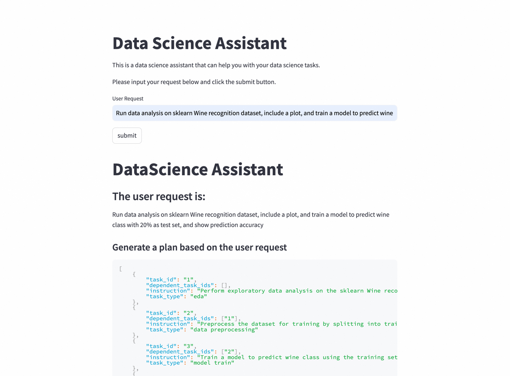
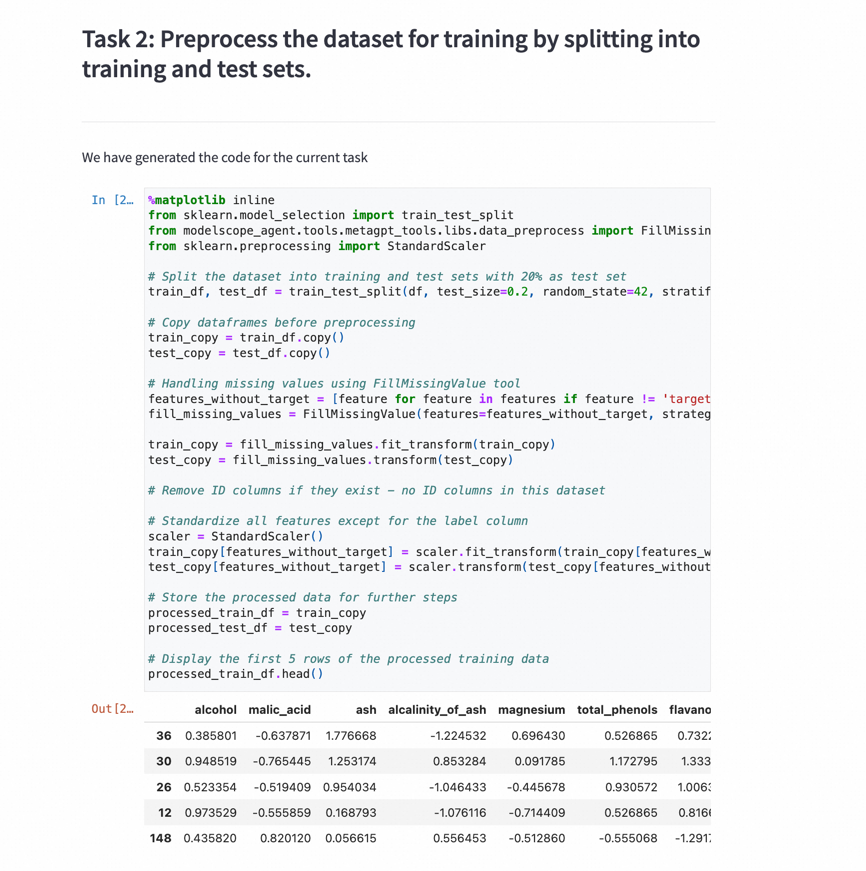
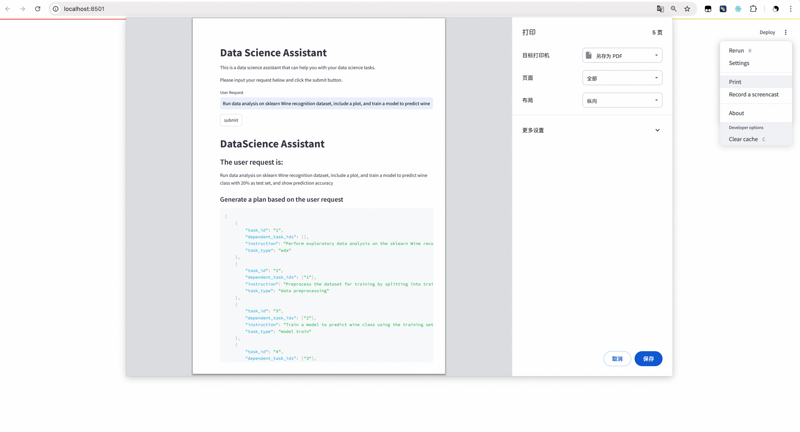

# Data Science Assistant with Streamlit ⭐
Data Science Assistant (hereinafter referred to as DS Assistant) is a Data Science Assistant developed based on the modelscope-agent framework, which can automatically perform exploratory Data analysis (EDA) in Data Science tasks according to user needs, Data preprocessing, feature engineering, model training, model evaluation and other steps are fully automated.

Detailed information can be found in the [documentation](../../docs/source/agents/data_science_assistant.md).

## Quick Start
Streamlit is a Python library that makes it easy to create and share beautiful, custom web apps for machine learning and data science.

To run the DS Assistant in streamlit, you need to install the Streamlit library. You can install it using pip:
```bash
pip install streamlit streamlit-jupyter
```
Then, you need to set
Then, you can run the DS Assistant using the following command:
```bash
streamlit run app.py
```

After running the command, a new tab will open in your default web browser with the DS Assistant running.
The following are screenshots of the DS Assistant running in the browser:


you can view all of the codes and  in streamlit

After you have finished using the DS Assistant, you can directly convert the running process to a pdf

