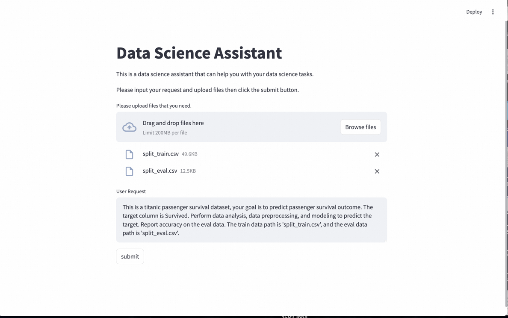
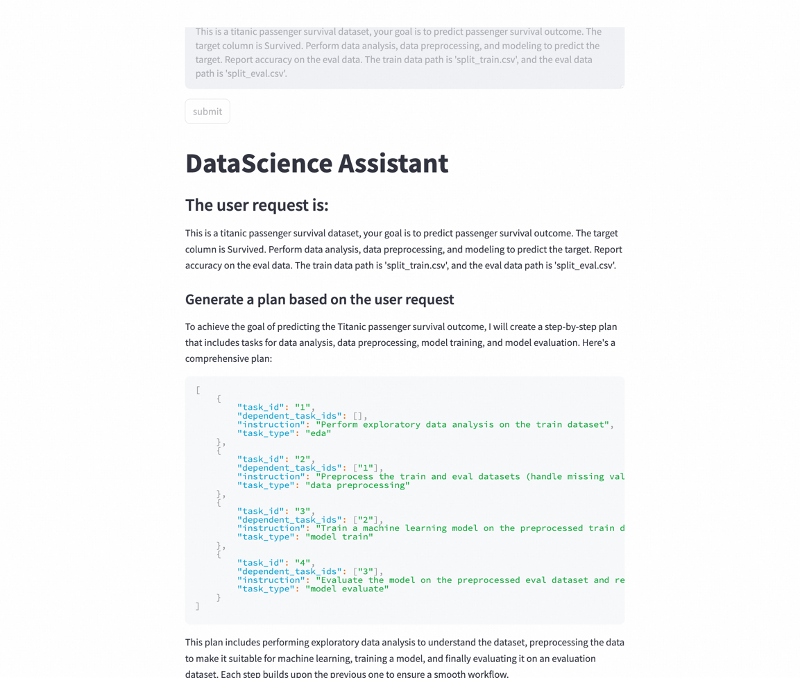

# Data Science Assistant with Streamlit ⭐
Data Science Assistant (hereinafter referred to as DS Assistant) is a Data Science Assistant developed based on the modelscope-agent framework, which can automatically perform exploratory Data analysis (EDA) in Data Science tasks according to user needs, Data preprocessing, feature engineering, model training, model evaluation and other steps are fully automated.

Detailed information can be found in the [documentation](../../docs/source/agents/data_science_assistant.md).

## Quick Start
Streamlit is a Python library that makes it easy to create and share beautiful, custom web apps for machine learning and data science.

To run the DS Assistant in streamlit, you need to install additional libraries. You can install it using pip:
```bash
pip install streamlit mistune matplotlib nbconvert
```

Then, you can run the DS Assistant using the following command:
```bash
cd ../../
streamlit run ./apps/datascience_assistant/app.py
```

After running the command, a new tab will open in your default web browser with the DS Assistant running.

you can upload your dataset and write your request.


After submitting your request, DS Assistant will automatically generate a plan for this request.


After that, DS Assistant will automatically excute every task, you can view all of the codes and details in streamlit


After you have finished using the DS Assistant, you can directly convert the running process to a pdf

