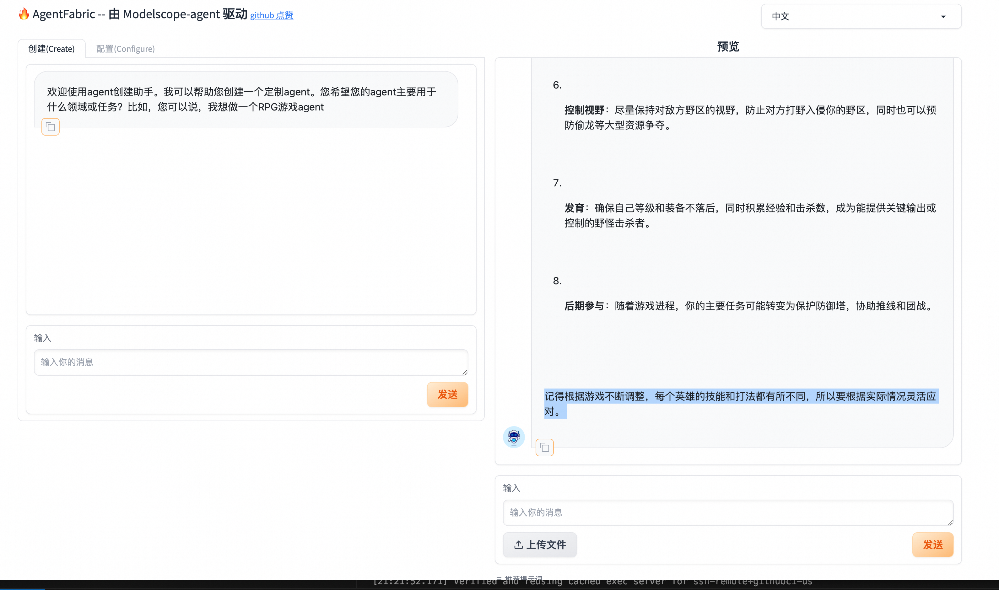
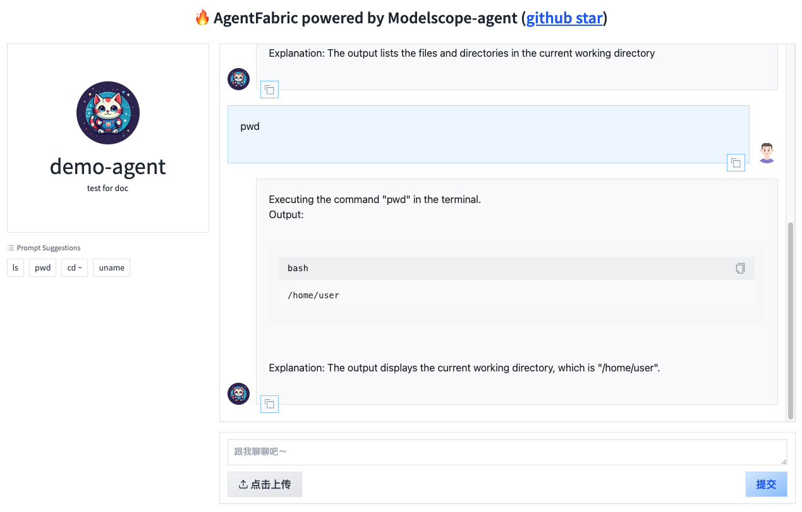

# 部署Modelscope-Agent

## 无外网环境部署 AgentFabric 及使用 AgentFabric 构建的 Agent


- 目标：在纯内网环境完成 Agent 的构建和发布
- 前提：需在有外网环境提前下载好所需内容

## 外网环境中下载所需内容


在可以访问外网的环境中，准备一个工作目录（如：`/data/work`），在这个目录下进行后续操作。

### 1. 拉取镜像

拉取 ModelScope-Agent 镜像，镜像中已经安装好所需依赖。

```shell
docker pull registry.cn-hangzhou.aliyuncs.com/modelscope-repo/modelscope-agent:v0.3.0
```

导出镜像文件：

```shell
docker save > modelscope-agent.tar \
registry.cn-hangzhou.aliyuncs.com/modelscope-repo/modelscope-agent:v0.3.0
```

启动容器：

```shell
docker run -ti -v /data/work:/data/work \
registry.cn-hangzhou.aliyuncs.com/modelscope-repo/modelscope-agent:v0.3.0 bash
```

> 其中 `-v /data/work:/data/work` 把本地 `/data/work` 目录挂载到容器中的相同路径。执行命令此命令后已进入容器，后续操作都将在容器中进行。

从容器中进入到工作目录：

```shell
cd /data/work
```

### 2. 下载 LLM 模型

在容器工作目录中下载模型到本地：以 qwen/Qwen1.5-7B-Chat 模型为例，可以换成其他微调的模型：

```shell
python -c "from modelscope import snapshot_download; snapshot_download('qwen/Qwen1.5-7B-Chat', cache_dir='qwen1.5-7b-chat')"
```

### 3. 下载 Embedding 模型

在容器工作目录中下载 ModelScope-Agent 使用的 Embedding 模型
[damo/nlp_gte_sentence-embedding_chinese-base](https://github.com/modelscope/modelscope-agent/blob/master/modelscope_agent/storage/vector_storage.py#L31)，
也可换成其他模型:

```shell
git clone https://www.modelscope.cn/iic/nlp_gte_sentence-embedding_chinese-base.git
```

### 4. 下载 ModelScope-Agent 代码

在容器工作目录中拉取 ModelScope-Agent 最新 master 分支代码：

```shell
git clone https://github.com/modelscope/modelscope-agent.git
```

### 5. 下载内容传输至内网环境

将工作目录传输至内网离线环境对应目录中，可同样使用 `/data/work`。


## 内网环境部署 LLM


### 导入镜像

进入工作路径 `/data/work`，导入镜像文件：

```shell
docker load < modelscope-agent.tar
```

### 部署 LLM 服务

ModelScope 提供模型 [本地启动服务](https://modelscope.cn/docs/%E6%9C%AC%E5%9C%B0%E5%90%AF%E5%8A%A8%E6%9C%8D%E5%8A%A1) 功能。

这里我们使用该功能，将模型部署成 Openai API 兼容的接口。具体操作可参考如下：

```shell
# 创建并进入容器
nvidia-docker run -ti --net host -v /data/work:/data/work \
registry.cn-hangzhou.aliyuncs.com/modelscope-repo/modelscope-agent:v0.3.0 bash
```

从容器中进入到工作目录：

```shell
cd /data/work
```

在容器工作目录中启动服务：

```shell
MODELSCOPE_CACHE='qwen1.5-7b-chat' python -m vllm.entrypoints.openai.api_server \
    --model qwen/Qwen1.5-7B-Chat --dtype=half --max-model-len 8192  --gpu-memory-utilization 0.95 &
```

随后测试模型服务，如果正确返回，说明模型服务部署完成。

```shell
curl http://localhost:8000/v1/chat/completions \
    -H "Content-Type: application/json" \
    -d '{
        "model": "qwen/Qwen1.5-7B-Chat",
        "messages": [
            {"role": "system", "content": "You are a helpful assistant."},
            {"role": "user", "content": "写一篇春天为主题的作文"}
        ],
        "stop": ["<|im_end|>", "<|endoftext|>"]
    }'
```

## 内网环境部署 AgentFabric


另起一个终端窗口，登录到上面拉起的 docker 容器中：

```shell
# 查看之前容器ID
sudo docker ps -a
# 进入对应容器ID的容器
sudo docker exec -ti CONTAINER_ID bash
```

在容器工作目录（`/data/work`）中进行后续操作。

### 编辑模型配置文件

编辑 `modelscope-agent/apps/agentfabric/config/model_config.json`， 增加如下配置：

```diff
diff --git a/apps/agentfabric/config/model_config.json b/apps/agentfabric/config/model_config.json
index 4db68ce..be7fbf3 100644
--- a/apps/agentfabric/config/model_config.json
+++ b/apps/agentfabric/config/model_config.json
@@ -124,5 +124,12 @@
         "api_base": "http://localhost:8000/v1",
         "is_chat": true,
         "is_function_call": false
+    },
+    "qwen1.5-7b-chat": {
+        "type": "openai",
+        "model": "qwen/Qwen1.5-7B-Chat",
+        "api_base": "http://localhost:8000/v1",
+        "is_chat": true,
+        "is_function_call": false
     }
 }
```

### 编辑 Embedding 模型 model_id

编辑 `modelscope-agent/modelscope_agent/storage/vector_storage.py`，将该文件中的模型 `model_id` 修改为本地模型路径：

```diff
diff --git a/modelscope_agent/storage/vector_storage.py b/modelscope_agent/storage/vector_storage.py
index c6f9fdc..29f518a 100644
--- a/modelscope_agent/storage/vector_storage.py
+++ b/modelscope_agent/storage/vector_storage.py
@@ -28,7 +28,7 @@ class VectorStorage(BaseStorage):
         self.storage_path = storage_path
         self.index_name = index_name
         self.embedding = embedding or ModelScopeEmbeddings(
-            model_id='damo/nlp_gte_sentence-embedding_chinese-base')
+            model_id='/data/work/nlp_gte_sentence-embedding_chinese-base')
         self.vs_cls = vs_cls
         self.vs_params = vs_params
         self.index_ext = index_ext
```

### 拉起 AgentFabric

在 `modelscope-agent/apps/agentfabric` 目录下执行如下命令拉起 AgentFabric Gradio：

```shell
GRADIO_SERVER_NAME=0.0.0.0 PYTHONPATH=../../  python app.py
```

> 启动时如遇 `ModuleNotFoundError: No module named 'modelscope_studio'` 报错，请将 `modelscope-agent` 仓库回滚至 `8deef6d4`（`git checkout 8deef6d4`），因为后面的 [68c7dd7f](https://github.com/modelscope/modelscope-agent/commit/68c7dd7ffae0a1f93938ac3fa3fed7bfdfcdfb2b#diff-8544efbeb959a409d00730a025fd51bf9da42cd560aa4d2bd5e24f6ddbd8c9f5R7) 提交修改了依赖，导致镜像中缺少新增的依赖。

> 如需更改默认配置文件路径，可修改 `modelscope-agent/apps/agentfabric/config_utils.py` 中的 `DEFAULT_AGENT_DIR` 和通过环境变量指定 `CODE_INTERPRETER_WORK_DIR`，如：
> ```shell
> CODE_INTERPRETER_WORK_DIR=/data/work/agentfabric/ci_workspace \
> GRADIO_SERVER_NAME=0.0.0.0 PYTHONPATH=../../  python app.py
> ```

然后在浏览器中输入 http://内网服务器IP:7860 打开即可看到如下界面。




## 内网环境发布使用 AgentFabric 构建的 Agent


通过 AgentFabric 完成 Agent 的基本配置之后，在 `配置(Configure)` tab 页点击左侧下方的 `更新配置` 按钮，
即可将自定义的配置内容生成至指定的配置文件中（默认路径为 `/tmp/agentfabric/config/local_user/builder_config.json`）。

完成配置后可停掉 AgentFabric 的 Gradio 应用。

发布配置好的 Agent Gradio 应用，可在 `modelscope-agent/apps/agentfabric` 目录下执行如下命令：

```shell
GRADIO_SERVER_NAME=0.0.0.0 GRADIO_SERVER_PORT=7865 PYTHONPATH=../../  python appBot.py
```

> 如启动 AgentFabric 时指定了配置文件路径，启动 Agent 时也需指定相同路径。

然后在浏览器中输入 http://内网服务器IP:7865 打开即可看到界面。


