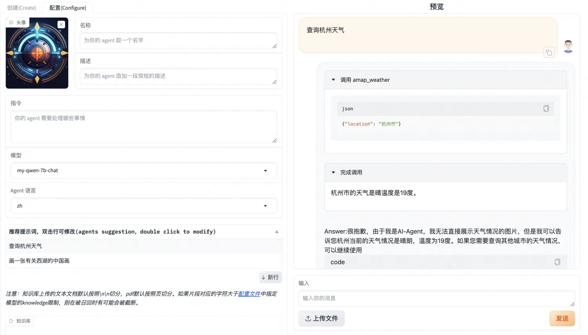

# AgentFabric llm工具调用能力微调

在使用DashScope提供的qwen api构建应用与定制交互的过程中，我们发现选取千亿级别参数的qwen-max或开源的qwen-72b等大规模参数模型能获得较好的工具调用和角色扮演效果。大规模参数模型效果好，但难以在消费级机器上进行本地部署调用；同时小模型如qwen-7b-chat对工具调用的能力较弱。因此本篇旨在针对AgentFabric的工具调用场景，提供可用的数据集和微调方法，使稍小的模型如qwen-7b-chat也具有能在AgentFabric中完成工具调用的能力。

## 环境安装

### 环境准备（基于modelscope镜像）

参考：[Agent微调最佳实践](https://github.com/modelscope/swift/blob/main/docs/source/LLM/Agent%E5%BE%AE%E8%B0%83%E6%9C%80%E4%BD%B3%E5%AE%9E%E8%B7%B5.md)

```shell
# 设置pip全局镜像 (加速下载)
pip config set global.index-url https://mirrors.aliyun.com/pypi/simple/
# 安装ms-swift
git clone https://github.com/modelscope/swift.git
cd swift
pip install -e .[llm]
# 环境对齐 (通常不需要运行. 如果你运行错误, 可以跑下面的代码, 仓库使用最新环境测试)
pip install -r requirements/framework.txt  -U
pip install -r requirements/llm.txt  -U
```

## 数据准备

为训练Agent能力，魔搭官方提供了两个开源数据集：
• 魔搭通用问答知识数据集 该数据集包含了38万条通用知识多轮对话数据，[魔搭通用问答知识数据集链接](https://www.modelscope.cn/datasets/iic/ms_bench/summary)
• 魔搭通用Agent训练数据集 该数据集包含了3万条Agent格式的API调用数据，[魔搭通用Agent训练数据集链接](https://www.modelscope.cn/datasets/iic/ms_agent/summary)
相关使用方式参考：[Agent微调最佳实践](https://github.com/modelscope/swift/blob/main/docs/source/LLM/Agent%E5%BE%AE%E8%B0%83%E6%9C%80%E4%BD%B3%E5%AE%9E%E8%B7%B5.md)

为了让qwen-7b-chat能够在AgentFabric上有比较好的效果，我们尝试使用通用Agent训练数据集ms_agent对qwen-7b-chat进行微调。微调后模型确实能够在ms_agent格式的prompt下获得工具调用能力。但在AgentFabric上对工具的调用表现欠佳，出现了不调用工具、调用工具时配置的参数错误、对工具调用结果的总结错误等，10次访问能成功正确调用1次。

考虑到AgentFabric是基于大规模文本模型调配的prompt，侧重角色扮演和应用，与ms_agent的prompt格式有区别。finetuned稍小模型的通用泛化性稍弱，换格式调用确实可能存在效果欠佳的情况。

原ms_agent prompt示例

```text
Answer the following questions as best you can. You have access to the following APIs:
1. fire_recognition: Call this tool to interact with the fire recognition API. This API is used to recognize whether there is fire in the image. Parameters: [{"name": "image", "description": "The input image to recognize fire", "required": "True"}]
Use the following format:
Thought: you should always think about what to do
Action: the action to take, should be one of the above tools[fire_recognition, fire_alert, call_police, call_fireman]
Action Input: the input to the action
Observation: the result of the action
... (this Thought/Action/Action Input/Observation can be repeated zero or more times)
Thought: I now know the final answer
Final Answer: the final answer to the original input question
Begin!
输入图片是/tmp/2.jpg，协助判断图片中是否存在着火点
# 工具
```

AgentFabric prompt示例

```text
# 工具
## 你拥有如下工具：
amap_weather: amap_weather API。获取对应城市的天气数据 输入参数: {"type": "object", "properties": {"location": {"type": "string", "description": "城市/区具体名称，如`北京市海淀区`请描述为`海淀区`"}}, "required": ["location"]} Format the arguments as a JSON object.
## 当你需要调用工具时，请在你的回复中穿插如下的工具调用命令，可以根据需求调用零次或多次：
工具调用
Action: 工具的名称，必须是[amap_weather]之一
Action Input: 工具的输入
Observation: <result>工具返回的结果</result>
Answer: 根据Observation总结本次工具调用返回的结果，如果结果中出现url，请使用如下格式展示出来：
# 指令
你扮演一个天气预报助手，你需要查询相应地区的天气，并调用给你的画图工具绘制一张城市的图。
请注意：你具有图像和视频的展示能力，也具有运行代码的能力，不要在回复中说你做不到。
(。你可以使用工具：[amap_weather])朝阳区天气怎样？
```

### ms_agent_for_agentfabric数据集

#### ms_agent 更新数据

为解决上述的prompt格式不匹配问题，我们首先将ms_agent转换成AgentFabric的prompt组织格式。从ms_agent到AgentFabric的转换过程可以通过如下脚本实现：

```python
import json
import re
sys_prefix = "\n# 工具\n\n## 你拥有如下工具：\n\n"
def _process_system(text):
    apis_info = []
    api_pattern = r"(?<=\n\d\.)(.*?})(?=])"
    apis = re.findall(api_pattern,text,re.DOTALL)
    sys_prompt = sys_prefix
    func_names = []
    for api in apis:
        func_name = re.search(r'(.*?):', api).group(1).strip()
        func_names.append(func_name)
        api_name = re.search(r'(\S+)\sAPI', api).group(1)
        api_desc = re.search(r"useful for\?\s(.*?)\.",api).group(1)
        sys_prompt += f"{func_name}: {api_name} API。{api_desc}" + "输入参数: {\"type\": \"object\", \"properties\": {"
        paras = re.findall(r"Parameters: \[({.*})",api,re.DOTALL)
        required_paras = []
        for para in paras:
            para_name = re.search(r'"name": "(.*?)"',para).group(1)
            desc = re.search(r'"description": "(.*?)"',para).group(1)
            if re.search(r'"required": "(.*)"',para).group(1).strip().lower() == "true": required_paras.append(para_name)
            sys_prompt += f'"\{para_name}\": {{\"type\": \"string\", \"description\": \"{desc}\"}}'
        sys_prompt += "},\"required\": " + json.dumps(required_paras) + "} Format the arguments as a JSON object." + "\n\n"
    func_names = json.dumps(func_names)
    sys_prompt += f"## 当你需要调用工具时，请在你的回复中穿插如下的工具调用命令，可以根据需求调用零次或多次：\n\n工具调用\nAction: 工具的名称，必须是{func_names}之一\nAction Input: 工具的输入\nObservation: <result>工具返回的结果</result>\nAnswer: 根据Observation总结本次工具调用返回的结果，如果结果中出现url，请使用如下格式展示出来：\n\n\n# 指令\n\n你扮演AI-Agent，\n你具有下列具体功能：\n下面你将开始扮演\n\n请注意：你具有图像和视频的展示能力，也具有运行代码的能力，不要在回复中说你做不到。\n"
    return sys_prompt
jsonl_file_path = 'ms_agent/train_agent_react.jsonl'
target_file_path = 'new_ms_agent.jsonl'
modified_data = []
with open(jsonl_file_path, 'r', encoding='utf-8') as file:
    for line in file:
        json_obj = json.loads(line)
        system_prompt = json_obj["conversations"][0]["value"]
        json_obj["conversations"][0]["value"] = _process_system(system_prompt)
        modified_data.append(json_obj)
with open(target_file_path, 'w', encoding='utf-8') as file:
    for json_obj in modified_data:
        file.write(json.dumps(json_obj, ensure_ascii=False) + '\n')
```

转换后的30000条数据已上传至modelscope数据集，[魔搭通用agent数据集（agentfabric版）链接](https://modelscope.cn/datasets/AI-ModelScope/ms_agent_for_agentfabric/summary)
使用该数据集finetune后，得到的模型在AgentFabric上的效果明显好转：每次访问都能够去调用工具，且基本能正确调用工具。但同时也有对工具调用结果的总结稍弱、有时无法自动停止输出等问题。

### AgentFabric新增数据

ms_agent数据集全为英文、且并无AgentFabric的roleplay等内容信息。虽然基模型qwen-7b-chat拥有中文能力，使通过new_ms_agent 数据集finetune后的模型能够正常识别用户意图，正确调用工具；但总结和停止能力都稍弱。 为此，我们通过开源的AgentFabric框架实际调用访问，获得了一些AgentFabric使用过程中实际发送给模型的prompt。筛选处理成一个数据集，加上new_ms_agent的数据一起finetune。得到的模型在AgentFabric上修复了此前的总结稍弱、有时无法自动停止问题。
多次调用均响应正常，甚至有一次get到了instruction中的内容。
处理好的488条数据已上传至modelscope数据集，[处理好的488条数据下载](https://modelscope.cn/api/v1/datasets/AI-ModelScope/ms_agent_for_agentfabric/repo?Revision=master&FilePath=addition.jsonl)
根据ms-agent转换格式得到的新数据集[ms_agent_for_agentfabric](https://modelscope.cn/datasets/AI-ModelScope/ms_agent_for_agentfabric/summary)，现已集成到[SWIFT](https://github.com/modelscope/swift)中。 其中ms-agent-for-agentfabric-default包含3万条由ms-agent转换的数据集，ms-agent-for-agentfabric-additional包含488条由开源的AgentFabric框架实际调用访问数据筛选得到

## 微调流程

### 在gpu机器执行

将`dataset`配置为`ms-agent-for-agentfabric-default`和`ms-agent-for-agentfabric-addition`，在8* A100 环境中可通过以下命令开启训练，需约2-3小时；如果是单卡训练，需要修改nproc_per_node=1。

```shell
# Experimental environment: A100
cd examples/pytorch/llm
# 如果使用1张卡则配置nproc_per_node=1
nproc_per_node=8
export PYTHONPATH=../../..
# 时间比较久，8*A100需要 2+小时，nohup运行
nohup torchrun \
    --nproc_per_node=$nproc_per_node \
    --master_port 29500 \
    llm_sft.py \
    --model_id_or_path qwen/Qwen-7B-Chat \
    --model_revision master \
    --sft_type lora \
    --tuner_backend swift \
    --dtype AUTO \
    --output_dir output \
    --dataset ms-agent-for-agentfabric-default ms-agent-for-agentfabric-addition \
    --train_dataset_mix_ratio 2.0 \
    --train_dataset_sample -1 \
    --num_train_epochs 2 \
    --max_length 1500 \
    --check_dataset_strategy warning \
    --lora_rank 8 \
    --lora_alpha 32 \
    --lora_dropout_p 0.05 \
    --lora_target_modules ALL \
    --self_cognition_sample 3000 \
    --model_name 卡卡罗特 \
    --model_author 陶白白 \
    --gradient_checkpointing true \
    --batch_size 2 \
    --weight_decay 0.1 \
    --learning_rate 5e-5 \
    --gradient_accumulation_steps $(expr 32 / $nproc_per_node) \
    --max_grad_norm 0.5 \
    --warmup_ratio 0.03 \
    --eval_steps 100 \
    --save_steps 100 \
    --save_total_limit 2 \
    --logging_steps 10 &
```

## 部署模型

此时我们获得了一个自己的finetuned model，可以将它部署到自己的机器上使用。以下执行过程参考了[VLLM推理加速与部署](https://github.com/modelscope/swift/blob/main/docs/source/LLM/VLLM%E6%8E%A8%E7%90%86%E5%8A%A0%E9%80%9F%E4%B8%8E%E9%83%A8%E7%BD%B2.md)

### 合并lora

由于sft_type=lora，部署需要先将LoRA weights合并到原始模型中：
```shell
python tools/merge_lora_weights_to_model.py --model_id_or_path /dir/to/your/base/model --model_revision master --ckpt_dir /dir/to/your/lora/model
```

其中需要替换 /dir/to/your/base/model 和 /dir/to/your/lora/model为自己本地的路径， /dir/to/your/lora/model为训练最终的best_model_checkpoint。/dir/to/your/base/model 可以通过snapshot_download接口查看，训练时使用的基模型为qwen/Qwen-7B-Chat，则本地路径为：

```python
from modelscope import snapshot_download
base_model_path = snapshot_download('qwen/Qwen-7B-Chat')
print(base_model_path)
```
也可以直接使用swift export指令完成merge lora
```shell
CUDA_VISIBLE_DEVICES=0 swift export \
    --ckpt_dir '/path/to/qwen-7b-chat/vx-xxx/checkpoint-xxx' --merge_lora true
```

### 拉起部署

```shell
nohup python -m vllm.entrypoints.openai.api_server --model /dir/to/your/model-merged --trust-remote-code &
```

测试部署：需要将/dir/to/your/model-merged替换成自己本地merge后的ckpt路径
```shell
curl http://localhost:8000/v1/completions -H "Content-Type: application/json" -d '{"model": "/dir/to/your/model-merged", "prompt": "San Francisco is a", "max_tokens": 7, "temperature": 0}'
```

也可以使用swift deploy 进行模型部署
```shell
CUDA_VISIBLE_DEVICES=0 swift deploy --ckpt_dir /path/to/qwen-7b-chat/vx-xxx/checkpoint-xxxx-merged
```
这种方式下测试部署和之后的config配置中的`"model"`需要改为qwen-7b-chat

## Modelscope-Agent中使用

### 简单测试

可通过如下代码简单测试模型能力，使用时需要将/dir/to/your/model-merged替换成自己本地merge后的ckpt路径。

```python
from modelscope_agent.agents.role_play import RolePlay  # NOQA
def test_weather_role():
    role_template = '你扮演一个天气预报助手，你需要查询相应地区的天气，并调用给你的画图工具绘制一张城市的图。'
    llm_config =  {
        "model_server": "openai",
        "model": "/dir/to/your/model-merged",
        "api_base": "http://localhost:8000/v1",
        "is_chat": True,
        "is_function_call": False,
        "support_stream": False
    }
    #llm_config = {"model": "qwen-max", "model_server": "dashscope"}
    # input tool name
    function_list = ['amap_weather']
    bot = RolePlay(
        function_list=function_list, llm=llm_config, instruction=role_template)
    response = bot.run('朝阳区天气怎样？')
    text = ''
    for chunk in response:
        text += chunk
    print(text)
    assert isinstance(text, str)
test_weather_role()
```

### Agentfabric中使用

#### 进入agentfabric目录

```shell
cd modelscope-agent/apps/agentfabric
```

#### 在config/model_config.json文件，新增训好的本地模型

```json
"my-qwen-7b-chat": {
        "type": "openai",
        "model": "/dir/to/your/model-merged",
        "api_base": "http://localhost:8000/v1",
        "is_chat": true,
        "is_function_call": false,
        "support_stream": false
    }
```

再次提醒，如果使用swift deoloy部署模型需要将"model"改为qwen-7b-chat

#### 设置API key

在以下实践中，会调用wanx image generation 和高德天气 ,需要点击[链接](https://github.com/modelscope/modelscope-agent/blob/master/README.md)按照教程进行注册并手动设置API KEY

```shell
export DASHSCOPE_API_KEY=your_api_key
export AMAP_TOKEN=your_api_key
```

#### 在agentfabric目录下执行如下命令拉起gradio

```shell
GRADIO_SERVER_NAME=0.0.0.0 PYTHONPATH=../../  python app.py
```

然后在浏览器中输入 服务器IP:7860 打开即可看到如下界面


内置能力选择agent可以调用的API, 这里选择`Wanx Image Generation`和`高德天气` 点击更新配置，等待配置完成后在右侧的输入栏中即可与Agent交互

> 天气查询




> 文生图


