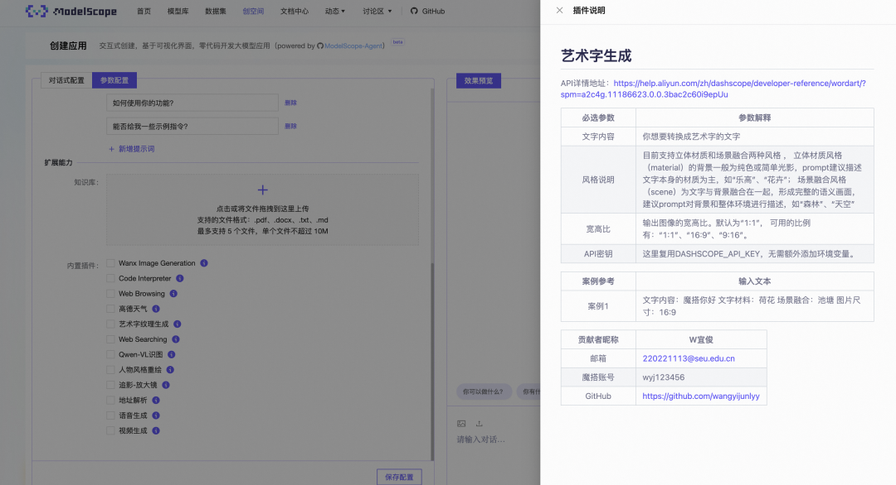

# How to Contribute a Tool
Developers are welcome to contribute tools and can submit a PR. Refer to: [PR Example](https://github.com/modelscope/modelscope-agent/pull/283/commits)

## Detailed Guide:

### Tool Registration

After multiple iterations, users can now integrate a new tool into the main repository more quickly.

Create your tool class file in the `modelscope_agent/tools` directory. Here, we assume the file is named `test_sambert_tool.py`.

Below is an example of integrating a new `tool` into the repository:

```python
import os
from modelscope_agent.tools.base import BaseTool, register_tool
from modelscope_agent.tools.utils.output_wrapper import AudioWrapper

WORK_DIR = os.getenv('CODE_INTERPRETER_WORK_DIR', '/tmp/ci_workspace')
@register_tool('test_sambert_tool')
class TestSambertTool(BaseTool):
    description = 'Sambert语音合成服务，将文本转成语音'
    name = 'test_sambert_tool'
    parameters: list = [{
        'name': 'text',
        'description': '需要转成语音的文本',
        'required': True,
        'type': 'string'
    }]
    def __init__(self, cfg={}):
        self.cfg = cfg.get(self.name, {})
        self.api_key = self.cfg.get('dashscope_api_key',
                                    os.environ.get('DASHSCOPE_API_KEY'))
        if self.api_key is None:
            raise ValueError('Please set valid DASHSCOPE_API_KEY!')
        super().__init__(cfg)
    def call(self, params: str, **kwargs) -> str:
        from dashscope.audio.tts import SpeechSynthesizer
        params = self._verify_args(params)
        tts_text = params['text']
        if tts_text is None or len(tts_text) == 0 or tts_text == '':
            raise ValueError('tts input text is valid')
        os.makedirs(WORK_DIR, exist_ok=True)
        wav_file = WORK_DIR + '/sambert_tts_audio.wav'
        response = SpeechSynthesizer.call(
            model='sambert-zhijia-v1', format='wav', text=tts_text)
        if response.get_audio_data() is not None:
            with open(wav_file, 'wb') as f:
                f.write(response.get_audio_data())
        else:
            raise ValueError(
                f'call sambert tts failed, request id: {response.get_response().request_id}'
            )
        return str(AudioWrapper(wav_file))
```

Interpretation:

- line 6: `@register_tool('test_sambert_tool')` is used to register the tool class to the registry for subsequent calls and is named `test_sambert_tool`.
- lines 8-15: When the tool is invoked by the large model, all the necessary information is defined in this section. The `name` and `description` of different tools must be clearly described so that the large model can use the tool correctly. Meanwhile, `parameters` need to be defined strictly according to the above format to ensure that the model can generate the parameters for calling the tool correctly. The parameters should include: `name`, `description`, `required`, and `type`.
- line 16: The `__init__()` method can load some non-runtime related configurations here.
- line 17: `self.cfg = cfg.get(self.name, {})` can be used to initialize a tool for scenarios with many configurations or where configuration needs to come from a file.
- line 23: The `call()` method defines how this tool performs tasks using parameters. Note that the input parameter is the `parameters` generated by the large model in the previous step, and it is passed in as a `string`.
- line 25: `params = self._verify_args(params)` parses and verifies the `parameters`, turning them into a `dict`. We have default methods to achieve this. For scenarios where the model's generation effect is not satisfactory or requires special parsing logic, users can implement this class themselves.
- lines 26-40: This section implements a method for calling the `tts` interface of `dashscope`. Users can implement the specific functionality of their `tool` here. For scenarios involving the calling of asynchronous APIs and requiring polling, you can refer to [here](https://github.com/modelscope/modelscope-agent/blob/master/modelscope_agent/tools/dashscope_tools/style_repaint.py).


### Other Configuration Items
- Configure the `register_map` in `modelscope_agent/tools/base.py` by adding `'test_sambert_tool': 'TestSambertTool'` to the dictionary. The format should be `registration_name: class_name`.
- Configure the `_import_structure` in `modelscope_agent/tools/__init__.py` by adding `'test_sambert_tool': ['TestSambertTool']`. The format should be `filename: class_name`.

### Using the Tool in the Agent
In the previous step, we have defined a new `tool` class. Below, we will demonstrate how to invoke it.

```python
import os
from modelscope_agent.agents import RolePlay
role_template = '你扮演一名语音合成大师，可以将文本转化为语音。'
llm_config = {
    'model': 'qwen-max',
    'model_server': 'dashscope',
    }
# For cases requiring additional configuration
function_list = [{
    'test_sambert_tool':{
      'dashscope_api_key': os.environ.get('DASHSCOPE_API_KEY')
    }
}]
# For cases not requiring additional configuration, just use the registered name
function_list = ['test_sambert_tool']
bot = RolePlay(function_list=function_list,llm=llm_config, instruction=role_template)
response = bot.run("请帮我把，modelscope-agent真厉害，用甜美女声念出来。", remote=False, print_info=True)
text = ''
for chunk in response:
    text += chunk
print(text)
```

Interpretation:

- line 2: Defines the prompt for the `agent`, used to drive the task.
- lines 3-6: Defines the model required by the `agent`. Currently, `qwen-max` is the best model in the qwen series for instruction understanding and generation.
- lines 8-14: Here, we add the newly registered tool `test_sambert_tool` to the `function_list` for the `agent` to call. Both configurations with `config` and by name alone are acceptable.
- line 15: Initializes the `agent` using the information from the above steps.
- lines 16-20: Submits the task to the `agent` to complete the relevant tool invocation.

Additionally, there is a demo available for reference: Please click [here](https://github.com/modelscope/modelscope-agent/blob/master/demo/demo_register_new_tool.ipynb).

### Documentation Preparation
- A `readme` is required to explain the meaning of the function parameters used in the code, and whether any additional configuration is needed to run the code successfully.
- Additionally, contributor information should be submitted so that the system can display contributor information.

- An example of the relevant readme is as follows:
-
```
# Speech Synthesis
API details: [https://help.aliyun.com/zh/dashscope/developer-reference/quick-start-13?spm=a2c4g.11186623.0.i4](https://help.aliyun.com/zh/dashscope/developer-reference/quick-start-13?spm=a2c4g.11186623.0.i4)

|  Required Parameters  |  Parameter Explanation  |
| --- | --- |
|  API Key  |  Reuse DASHSCOPE\_API\_KEY here, no need to add an extra environment variable. |
|  Contributor Nickname  |  XXX  |
| --- | --- |
|  Email  |  xxx@xxx |
|  Modao Account  |  xxx  |
|  GitHub  |  [https://github.com/xxx](https://github.com/xxx)  |
```

Alternatively, refer to the introduction documents of other tools:



### Adding Unit Tests
- Besides developing the core module, you also need to add unit test cases to ensure functionality completeness. You can refer to: [code interpreter unit test](../../tests/tools/test_code_interpreter.py).
- To run the test cases, you only need to ensure that the current test cases pass.
- `modelscope-agent` uses `pytest` for testing. Therefore, if `pytest` is not installed, you need to install it first. A specific example of running the tests is as follows:

```shell
pytest modelscope-agent/tools/contrib/demo/test_case.py
```

### Summary: Document Structure
In summary, to ensure the standardization of the document structure, please adjust the document structure for the code to be submitted.
- Three files need to be submitted: the implementation file, the test file, and the `readme`.
- These three files need to be placed in a single folder. To ensure this folder can be referenced, an `__init__.py` file is also required.
- You need to reconfigure the modifications made to `_import_structure` in `modelscope_agent/tools/__init__.py` for testing. Refer to the example below.
- Finally, you need to ensure that this folder is located under `modelscope_agent/tools/contrib`.

An example is shown in the image below:

```
contrib
├── __init__.py
└── demo
    ├── README.md
    ├── __init__.py
    ├── renew_aliyun_instance.py
    └── test_case.py
```

- The class needs to be added to `modelscope_agent/tools/contrib/__init__.py` to be referenced by the upper layer. Refer to [tools/contrib](../../../modelscope_agent/tools/contrib/demo).
- Re-execute to ensure the code is functional.

### Code Submission Standards
- For all newly added tool classes, you need to fork an independent repository from the modelscope-agent repository and submit on a separate branch. The naming rule is:

```shell
git checkout -b tool/{your-new-tool-name}
```

- After adding the new code and corresponding unit test cases, ensure the code format is correct. You can refer to the following commands to ensure the installation of the auto format check/update tool pre-commit:


```shell
# For first-time runners, you need to install pre-commit and initialize it in the project
pip install pre-commit
pre-commit install
pre-commit run --all-files
# Subsequently, automatic format checks and fixes will run on every commit. You can use the following commands:
git add .
git commit -m "add new tool"
# If you encounter format errors that cannot be automatically fixed, you can try to manually modify them or skip the checks
git commit -m "add new tool" --no-verify
```

- After finally submitting to the code repository, you can merge into the main repository by submitting a PR [here](https://github.com/modelscope/modelscope-agent/compare). The maintainers of the modelscope-agent main repository will verify and merge the changes as soon as possible.
