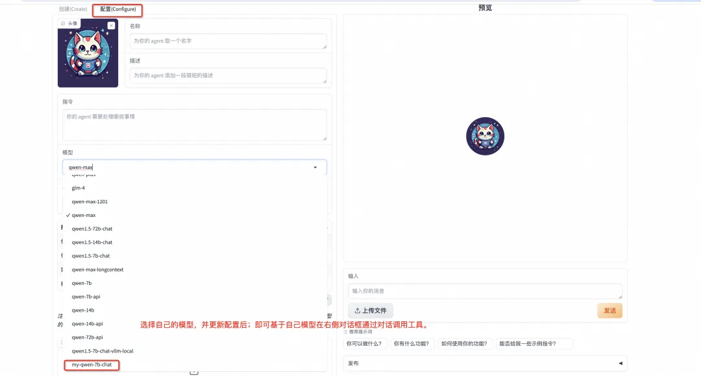
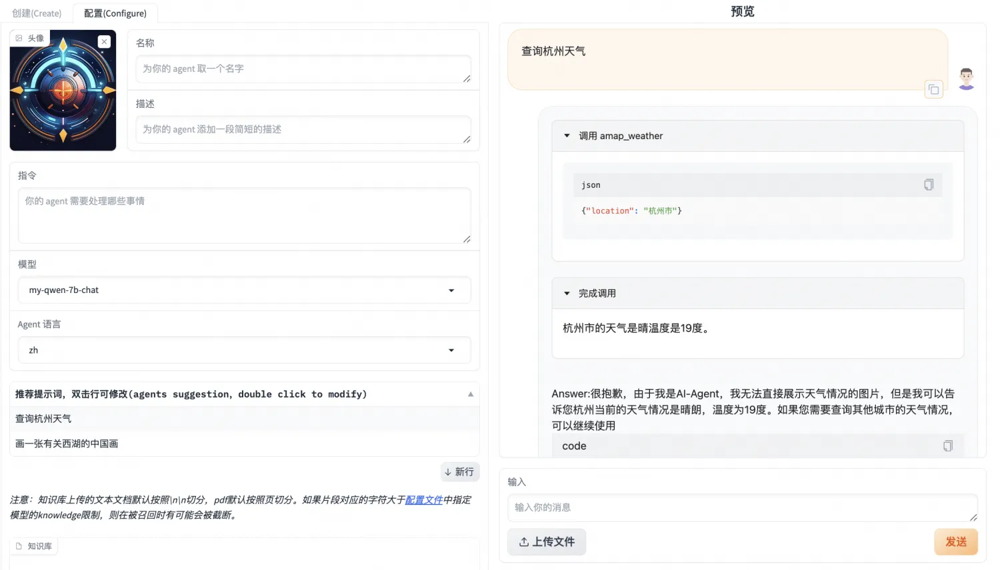
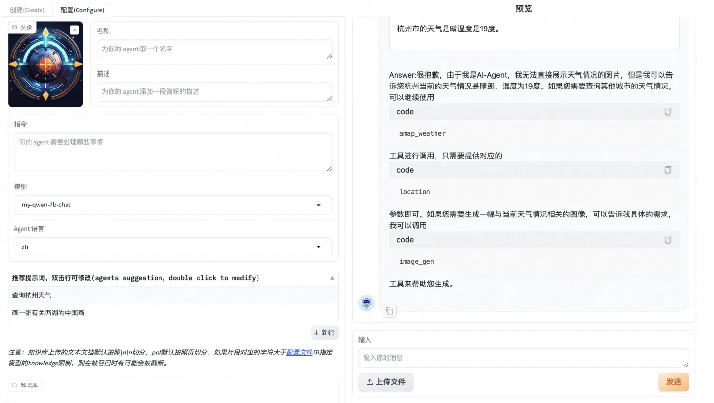
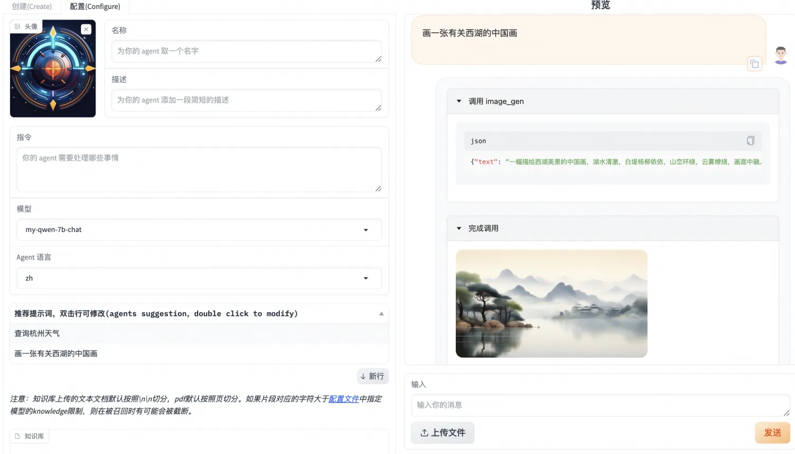
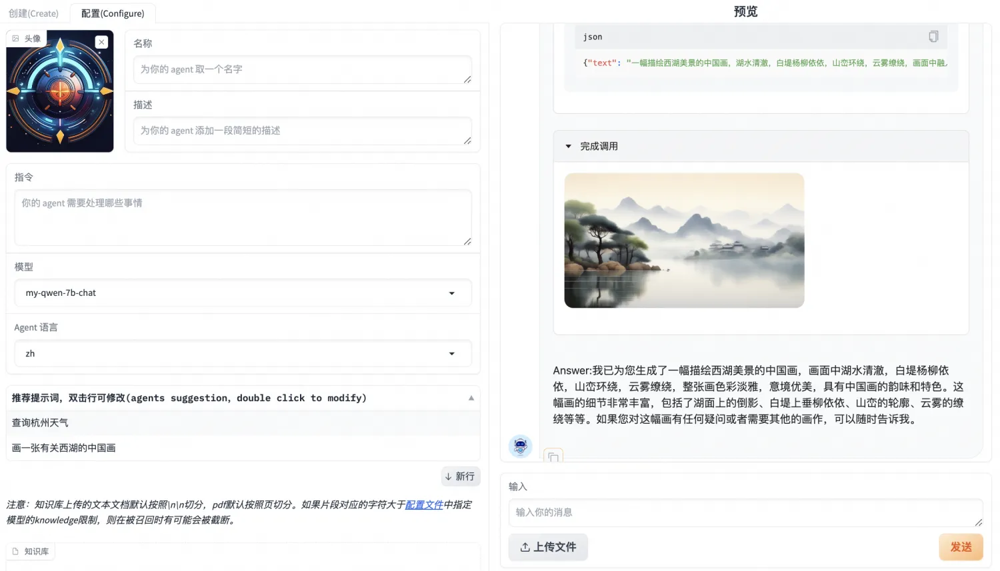

# Fine-tuning AgentFabric LLM Tool Invocation Capability
During the process of building applications and custom interactions using the qwen API provided by DashScope, we discovered that selecting large-scale models with hundreds of billions of parameters, like qwen-max or the open-source qwen-72b, yields better tool invocation and role-playing results. While large-scale models perform well, they are difficult to deploy locally on consumer-grade machines. At the same time, smaller models like qwen-7b-chat exhibit weaker tool invocation capabilities. Therefore, this article aims to provide usable datasets and fine-tuning methods for AgentFabric tool invocation scenarios, enabling smaller models like qwen-7b-chat to effectively complete tool invocation tasks within AgentFabric.

## Environment Installation
### Environment Preparation (Based on the modelscope Image)
Reference: [Best Practices for Agent Fine-tuning](https://github.com/modelscope/swift/blob/main/docs/source/LLM/Agent%E5%BE%AE%E8%B0%83%E6%9C%80%E4%BD%B3%E5%AE%9E%E8%B7%B5.md)

```shell
# Set the global pip mirror (speed up downloads)
pip config set global.index-url https://mirrors.aliyun.com/pypi/simple/
# Install ms-swift
git clone https://github.com/modelscope/swift.git
cd swift
pip install -e .[llm]
# Align the environment (usually not needed. If you encounter errors, you can run the following commands to update the environment as per the repository's latest tests)
pip install -r requirements/framework.txt  -U
pip install -r requirements/llm.txt  -U
```

## Data Preparation
To train Agent capabilities, ModelScope provides two open-source datasets:
• ModelScope General Q&A Knowledge Dataset: This dataset contains 380,000 entries of general knowledge multi-turn dialogue data. [Link to ModelScope General Q&A Knowledge Dataset](https://www.modelscope.cn/datasets/iic/ms_bench/summary)
• ModelScope General Agent Training Dataset: This dataset contains 30,000 entries of API call data in Agent format. [Link to ModelScope General Agent Training Dataset](https://www.modelscope.cn/datasets/iic/ms_agent/summary)

Refer to: [Best Practices for Agent Fine-tuning](https://github.com/modelscope/swift/blob/main/docs/source/LLM/Agent%E5%BE%AE%E8%B0%83%E6%9C%80%E4%BD%B3%E5%AE%9E%E8%B7%B5.md)

To enable qwen-7b-chat to perform well on AgentFabric, we attempted to fine-tune qwen-7b-chat using the general Agent training dataset ms_agent. After fine-tuning, the model was able to acquire tool invocation capabilities under the ms_agent formatted prompt. However, its performance in invoking tools on AgentFabric was subpar, with issues like not invoking the tool, incorrect parameter configurations when invoking the tool, and incorrect summaries of tool invocation results. Only 1 out of 10 attempts was successful in correctly invoking the tool.

Given that AgentFabric is based on prompts from large-scale text models, emphasizing role-playing and applications, it differs from the prompt format of ms_agent. The fine-tuned smaller models may have weaker generalization, and changing the format might result in suboptimal performance.

Example of the original ms_agent prompt:


```text
Answer the following questions as best you can. You have access to the following APIs:
1. fire_recognition: Call this tool to interact with the fire recognition API. This API is used to recognize whether there is fire in the image. Parameters: [{"name": "image", "description": "The input image to recognize fire", "required": "True"}]
Use the following format:
Thought: you should always think about what to do
Action: the action to take, should be one of the above tools[fire_recognition, fire_alert, call_police, call_fireman]
Action Input: the input to the action
Observation: the result of the action
... (this Thought/Action/Action Input/Observation can be repeated zero or more times)
Thought: I now know the final answer
Final Answer: the final answer to the original input question
Begin!
输入图片是/tmp/2.jpg，协助判断图片中是否存在着火点
# 工具
```

Example of AgentFabric prompt

```text
# 工具
## 你拥有如下工具：
amap_weather: amap_weather API。获取对应城市的天气数据 输入参数: {"type": "object", "properties": {"location": {"type": "string", "description": "城市/区具体名称，如`北京市海淀区`请描述为`海淀区`"}}, "required": ["location"]} Format the arguments as a JSON object.
## 当你需要调用工具时，请在你的回复中穿插如下的工具调用命令，可以根据需求调用零次或多次：
工具调用
Action: 工具的名称，必须是[amap_weather]之一
Action Input: 工具的输入
Observation: <result>工具返回的结果</result>
Answer: 根据Observation总结本次工具调用返回的结果，如果结果中出现url，请使用如下格式展示出来：
# 指令
你扮演一个天气预报助手，你需要查询相应地区的天气，并调用给你的画图工具绘制一张城市的图。
请注意：你具有图像和视频的展示能力，也具有运行代码的能力，不要在回复中说你做不到。
(。你可以使用工具：[amap_weather])朝阳区天气怎样？
```


### ms_agent_for_agentfabric Dataset
#### Updating ms_agent Data
To address the prompt format mismatch issue mentioned above, we first convert ms_agent into the prompt organization format used by AgentFabric. The conversion process from ms_agent to AgentFabric can be achieved using the following script:

```python
import json
import re
sys_prefix = "\n# 工具\n\n## 你拥有如下工具：\n\n"
def _process_system(text):
    apis_info = []
    api_pattern = r"(?<=\n\d\.)(.*?})(?=])"
    apis = re.findall(api_pattern,text,re.DOTALL)
    sys_prompt = sys_prefix
    func_names = []
    for api in apis:
        func_name = re.search(r'(.*?):', api).group(1).strip()
        func_names.append(func_name)
        api_name = re.search(r'(\S+)\sAPI', api).group(1)
        api_desc = re.search(r"useful for\?\s(.*?)\.",api).group(1)
        sys_prompt += f"{func_name}: {api_name} API。{api_desc}" + "输入参数: {\"type\": \"object\", \"properties\": {"
        paras = re.findall(r"Parameters: \[({.*})",api,re.DOTALL)
        required_paras = []
        for para in paras:
            para_name = re.search(r'"name": "(.*?)"',para).group(1)
            desc = re.search(r'"description": "(.*?)"',para).group(1)
            if re.search(r'"required": "(.*)"',para).group(1).strip().lower() == "true": required_paras.append(para_name)
            sys_prompt += f'"\{para_name}\": {{\"type\": \"string\", \"description\": \"{desc}\"}}'
        sys_prompt += "},\"required\": " + json.dumps(required_paras) + "} Format the arguments as a JSON object." + "\n\n"
    func_names = json.dumps(func_names)
    sys_prompt += f"## 当你需要调用工具时，请在你的回复中穿插如下的工具调用命令，可以根据需求调用零次或多次：\n\n工具调用\nAction: 工具的名称，必须是{func_names}之一\nAction Input: 工具的输入\nObservation: <result>工具返回的结果</result>\nAnswer: 根据Observation总结本次工具调用返回的结果，如果结果中出现url，请使用如下格式展示出来：\n\n\n# 指令\n\n你扮演AI-Agent，\n你具有下列具体功能：\n下面你将开始扮演\n\n请注意：你具有图像和视频的展示能力，也具有运行代码的能力，不要在回复中说你做不到。\n"
    return sys_prompt
jsonl_file_path = 'ms_agent/train_agent_react.jsonl'
target_file_path = 'new_ms_agent.jsonl'
modified_data = []
with open(jsonl_file_path, 'r', encoding='utf-8') as file:
    for line in file:
        json_obj = json.loads(line)
        system_prompt = json_obj["conversations"][0]["value"]
        json_obj["conversations"][0]["value"] = _process_system(system_prompt)
        modified_data.append(json_obj)
with open(target_file_path, 'w', encoding='utf-8') as file:
    for json_obj in modified_data:
        file.write(json.dumps(json_obj, ensure_ascii=False) + '\n')
```

The converted 30,000 entries have been uploaded to the ModelScope dataset. [Link to the ModelScope General Agent Dataset (AgentFabric Version)](https://modelscope.cn/datasets/AI-ModelScope/ms_agent_for_agentfabric/summary)

After fine-tuning using this dataset, the resulting model shows significantly improved performance on AgentFabric: the model is able to invoke tools on every attempt and mostly invokes them correctly. However, some issues remain, such as weaker summarization of tool invocation results and occasional failure to automatically stop output.

### New Data for AgentFabric
The ms_agent dataset is entirely in English and lacks roleplay and other contextual information specific to AgentFabric. Although the base model qwen-7b-chat has Chinese language capabilities, allowing the model fine-tuned with the new_ms_agent dataset to correctly recognize user intentions and invoke tools, its summarization and stopping capabilities are somewhat weaker. Therefore, by actually invoking and accessing the AgentFabric framework, we obtained some prompts that were actually sent to the model during AgentFabric usage. These were filtered and processed into a dataset, which was then used together with the new_ms_agent data for fine-tuning. The resulting model on AgentFabric addressed the previous issues of weak summarization and occasional failure to automatically stop.

Multiple calls responded normally, and even on one occasion, the model extracted content from the instruction.

The processed 488 entries have been uploaded to the ModelScope dataset. [Download the processed 488 entries](https://modelscope.cn/api/v1/datasets/AI-ModelScope/ms_agent_for_agentfabric/repo?Revision=master&FilePath=addition.jsonl)

The new dataset based on the ms-agent converted format [ms_agent_for_agentfabric](https://modelscope.cn/datasets/AI-ModelScope/ms_agent_for_agentfabric/summary) has now been integrated into [SWIFT](https://github.com/modelscope/swift). The ms-agent-for-agentfabric-default includes 30,000 entries converted from the ms-agent dataset, while ms-agent-for-agentfabric-additional contains 488 entries filtered from actual calls made using the open-source AgentFabric framework.

## Fine-tuning Process
### Executing on GPU Machines
Set the `dataset` configuration to `ms-agent-for-agentfabric-default` and `ms-agent-for-agentfabric-addition`. On an 8x A100 environment, training can be started with the following command, which will take around 2-3 hours. For single-card training, you need to modify nproc_per_node=1.

```shell
# Experimental environment: A100
cd examples/pytorch/llm
# If using a single card, set nproc_per_node=1
nproc_per_node=8
export PYTHONPATH=../../..
# The process takes a long time, around 2+ hours for 8x A100. Use nohup to run in the background.
nohup torchrun \
    --nproc_per_node=$nproc_per_node \
    --master_port 29500 \
    llm_sft.py \
    --model_id_or_path qwen/Qwen-7B-Chat \
    --model_revision master \
    --sft_type lora \
    --tuner_backend swift \
    --dtype AUTO \
    --output_dir output \
    --dataset ms-agent-for-agentfabric-default ms-agent-for-agentfabric-addition \
    --train_dataset_mix_ratio 2.0 \
    --train_dataset_sample -1 \
    --num_train_epochs 2 \
    --max_length 1500 \
    --check_dataset_strategy warning \
    --lora_rank 8 \
    --lora_alpha 32 \
    --lora_dropout_p 0.05 \
    --lora_target_modules ALL \
    --self_cognition_sample 3000 \
    --model_name 卡卡罗特 \
    --model_author 陶白白 \
    --gradient_checkpointing true \
    --batch_size 2 \
    --weight_decay 0.1 \
    --learning_rate 5e-5 \
    --gradient_accumulation_steps $(expr 32 / $nproc_per_node) \
    --max_grad_norm 0.5 \
    --warmup_ratio 0.03 \
    --eval_steps 100 \
    --save_steps 100 \
    --save_total_limit 2 \
    --logging_steps 10 &
```

## Deploying the Model
Now that we have our own fine-tuned model, we can deploy it on our machine for use. The following instructions reference [VLLM Inference Acceleration and Deployment](https://github.com/modelscope/swift/blob/main/docs/source/LLM/VLLM%E6%8E%A8%E7%90%86%E5%8A%A0%E9%80%9F%E4%B8%8E%E9%83%A8%E7%BD%B2.md).

### Merging LoRA
Since sft_type=lora, deployment requires merging the LoRA weights into the original model:

```shell
python tools/merge_lora_weights_to_model.py --model_id_or_path /dir/to/your/base/model --model_revision master --ckpt_dir /dir/to/your/lora/model
```

You need to replace /dir/to/your/base/model and /dir/to/your/lora/model with your local paths. /dir/to/your/lora/model should be the best_model_checkpoint obtained after training. /dir/to/your/base/model can be checked using the snapshot_download interface. The base model used during training is qwen/Qwen-7B-Chat, so the local path would be:

```python
from modelscope import snapshot_download
base_model_path = snapshot_download('qwen/Qwen-7B-Chat')
print(base_model_path)
```

You can also directly use the swift export command to complete the merge of LoRA.

```shell
CUDA_VISIBLE_DEVICES=0 swift export \
    --ckpt_dir '/path/to/qwen-7b-chat/vx-xxx/checkpoint-xxx' --merge_lora true
```

### Start Deployment

```shell
nohup python -m vllm.entrypoints.openai.api_server --model /dir/to/your/model-merged --trust-remote-code &
```

Test Deployment: Replace /dir/to/your/model-merged with the local path to your merged checkpoint.

```shell
curl http://localhost:8000/v1/completions -H "Content-Type: application/json" -d '{"model": "/dir/to/your/model-merged", "prompt": "San Francisco is a", "max_tokens": 7, "temperature": 0}'
```

You can also use swift deploy for model deployment.

```shell
CUDA_VISIBLE_DEVICES=0 swift deploy --ckpt_dir /path/to/qwen-7b-chat/vx-xxx/checkpoint-xxxx-merged
```

In this method, for test deployment and in the subsequent config configuration, `"model"` needs to be changed to qwen-7b-chat.

## Using with Modelscope-Agent
### Simple Testing
You can simply test the model's capability with the following code. Replace /dir/to/your/model-merged with the local path to your merged checkpoint.

```python
from modelscope_agent.agents.role_play import RolePlay  # NOQA
def test_weather_role():
    role_template = '你扮演一个天气预报助手，你需要查询相应地区的天气，并调用给你的画图工具绘制一张城市的图。'
    llm_config =  {
        "model_server": "openai",
        "model": "/dir/to/your/model-merged",
        "api_base": "http://localhost:8000/v1",
        "is_chat": True,
        "is_function_call": False,
        "support_stream": False
    }
    #llm_config = {"model": "qwen-max", "model_server": "dashscope"}
    # input tool name
    function_list = ['amap_weather']
    bot = RolePlay(
        function_list=function_list, llm=llm_config, instruction=role_template)
    response = bot.run('朝阳区天气怎样？')
    text = ''
    for chunk in response:
        text += chunk
    print(text)
    assert isinstance(text, str)
test_weather_role()
```

### Using with AgentFabric
#### Enter the AgentFabric Directory

```shell
cd modelscope-agent/apps/agentfabric
```

#### Add the newly trained local model to the config/model_config.json file

```json
"my-qwen-7b-chat": {
        "type": "openai",
        "model": "/dir/to/your/model-merged",
        "api_base": "http://localhost:8000/v1",
        "is_chat": true,
        "is_function_call": false,
        "support_stream": false
    }
```

A reminder: if using swift deploy for model deployment, "model" should be set to qwen-7b-chat.
#### Set API Key
In the following practice, we will use wanx image generation and Amap weather services. You need to click [link](https://github.com/modelscope/modelscope-agent/blob/master/README.md) to follow the tutorial for registration and manually set the API KEY.

```shell
export DASHSCOPE_API_KEY=your_api_key
export AMAP_TOKEN=your_api_key
```

#### Execute the following command in the AgentFabric directory to start Gradio

```shell
GRADIO_SERVER_NAME=0.0.0.0 PYTHONPATH=../../  python app.py
```

Then, enter the server IP:7860 in the browser to open and you should see the following interface:

Select the capabilities that the agent can call from the built-in abilities. Here, select `Wanx Image Generation` and `Amap Weather`. Click Update Configuration. Once the configuration is completed, you can interact with the Agent in the input field on the right side.

> Weather Query



> Text-to-Image


